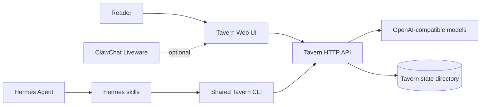

<div align="center">

# Nora's Tavern

### Persistent worlds for multi-character AI stories

An open-source storytelling system that runs as a standalone web app or as a controllable workspace for Hermes Agent.

[简体中文](README.zh-CN.md) · [Quick start](#quick-start) · [Hermes integration](#hermes-agent) · [Documentation](#documentation)

[](https://github.com/LoveMaker-art/noras-tavern/releases/latest)
[](LICENSE)
[](https://www.python.org/)
[](docs/hermes.md)

</div>


Nora's Tavern keeps the parts of a long-running story that ordinary chat interfaces tend to lose: the world, the cast, the player's persona, active lore, character changes, and a compact story ledger. The interface stays focused on the scene while the state model works behind it.

## What It Includes

- **Multi-character worlds** with a player persona, cast roster, worldbooks, triggered lore, and persistent sessions.
- **Long-story continuity** through scheduled story-ledger compression and structured character-state updates.
- **Portable character cards** with normalized imports for common Tavern/SillyTavern card data.
- **Story controls** for continue, regenerate, edit, smart replies, text-model selection, and voice playback.
- **World presentation** with per-world desktop/mobile backgrounds, typography, color, and reading surfaces.
- **Agent operations** through Hermes skills that can create worlds, import material, manage models, inspect state, and update the application.
- **State isolation**: source code and user data live in separate directories, so releases can be applied without replacing stories or credentials.

## Product Preview

| Mobile story view | World and cast workspace |
| --- | --- |
|  |  |

The same world is available as a focused mobile reading experience and a desktop workspace for inspecting the cast, lore, libraries, models, and story profile.

## Choose Your Setup

| Goal | Install | Best for |
| --- | --- | --- |
| Run Tavern by itself | `app/` | A private or self-hosted storytelling web app |
| Run Tavern with Hermes | `app/`, `skills/`, `integrations/hermes/` | Letting an agent build and operate worlds through natural language |
| Add ClawChat Liveware | Hermes setup plus the optional hook | Opening Tavern from an existing ClawChat conversation |

Tavern does not require Liveware. Liveware is an optional ClawChat surface; Hermes is the agent integration provided by this repository.

## Quick Start

Requirements: Python 3.10+ and an OpenAI-compatible Chat Completions endpoint.

```bash
git clone https://github.com/LoveMaker-art/noras-tavern.git
cd noras-tavern
python3 start.py
```

The first run asks for the model endpoint, API key, and model ID, then creates the local environment, installs dependencies, and saves `.env`. Later starts use the same `python3 start.py` command. On Windows, use `py start.py`.

When the terminal prints `Tavern → http://127.0.0.1:8799`, open that address. Do not open `app/frontend/index.html` directly: the static page has no backend and will report that Tavern cannot reach its backend. Runtime data is written only to `TAVERN_STATE_DIR`, not to the source tree.

For production deployment, reverse proxies, environment variables, and storage boundaries, follow the [standalone deployment guide](docs/standalone.md) and [configuration reference](docs/configuration.md).

## Hermes Agent

For an existing Hermes installation, the verified bootstrap installs or updates the Tavern application, the complete skill set, and the managed Hermes integration files:

```bash
curl -fsSL https://github.com/LoveMaker-art/noras-tavern/releases/latest/download/install-tavern-updater.sh | sh -s -- --apply --confirm
```

The updater reviews the release manifest, checks compatibility, creates rollback material, applies managed files, and performs a health check. Worlds, cards, stories, model configuration, identity, and uploaded assets remain outside its overwrite boundary.

If Tavern is already running and you only need the skills, install the repository as a [Hermes Custom Tap](docs/hermes.md#只安装技能).

## How It Fits Together



The web UI and Hermes skills operate on the same Tavern API and state. The agent does not edit production JSON directly; the shared CLI and HTTP boundary keep operations predictable.

## Repository Layout

```text
app/backend/             Tavern backend source
app/frontend/            Tavern web frontend source
app/assets/              Built-in templates and runtime assets
skills/                  Hermes Custom Tap and shared CLI
integrations/hermes/     Optional AGENTS and SOUL templates
tools/                   Portable Tavern CLI entry point
bootstrap/               Verified updater bootstrap
docs/                    Deployment, configuration, and architecture
scripts/                 Release build tooling
tests/                   Backend, frontend, updater, and boundary tests
```

No user worlds, cards, conversations, credentials, ClawChat sessions, or registration records belong in the source tree.

## Documentation

| Guide | Covers |
| --- | --- |
| [Standalone deployment](docs/standalone.md) | Local and server installation without Hermes |
| [Hermes deployment](docs/hermes.md) | Skills, paths, hooks, ClawChat, and updates |
| [Configuration](docs/configuration.md) | Models, storage, security, and performance |
| [Architecture](docs/architecture.md) | Runtime boundaries, state, APIs, and release design |
| [Contributing](CONTRIBUTING.md) | Development workflow and pull requests |
| [Security policy](SECURITY.md) | Reporting vulnerabilities and handling secrets |

## Development

```bash
PYTHONPATH=app/backend python3 -m unittest discover -s tests -v
node --test tests/frontend_security.test.js
python3 scripts/build_release.py
```

See [CONTRIBUTING.md](CONTRIBUTING.md) before changing runtime boundaries, state migrations, updater manifests, or shared skills.

## License

Nora's Tavern is licensed under [GNU AGPL-3.0-only](LICENSE). If you provide a modified version over a network, you must make the corresponding source available as required by section 13 of the AGPL.

Releases up to and including `v1.18.1` remain available under the MIT License shipped with those releases.
