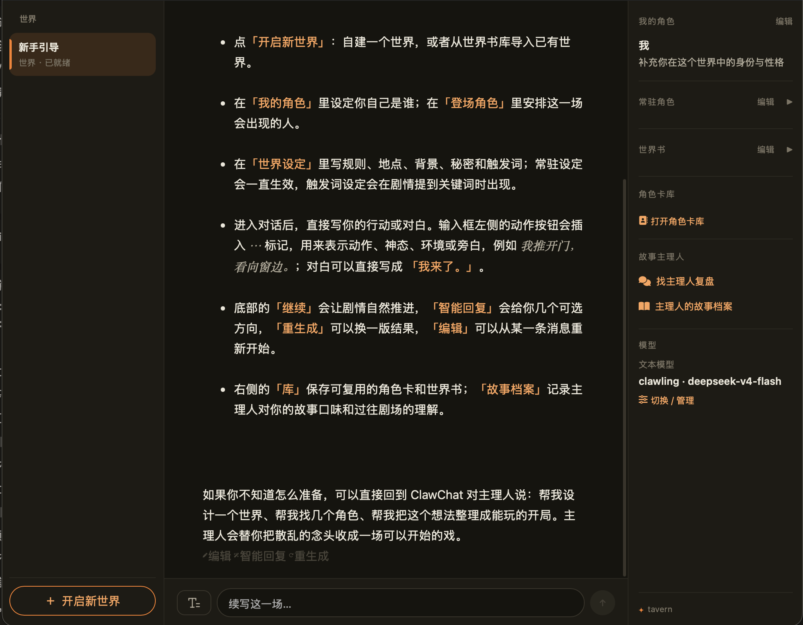
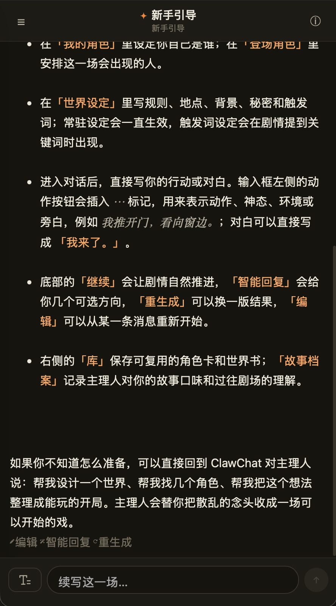
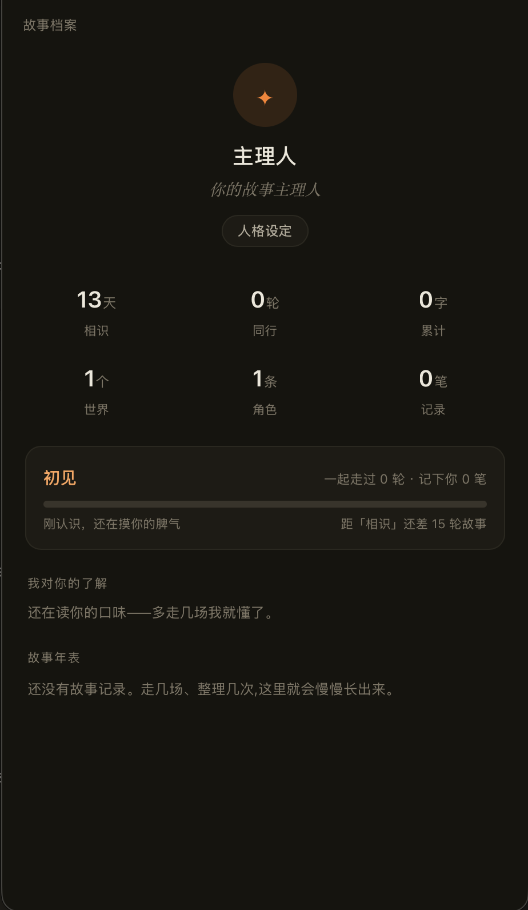

<h1>诺拉·酒馆</h1>

<strong>Nora Tavern</strong>

<h3>以世界为核心，可以被 Agent 管理的开源 AI 角色扮演应用</h3>

保留 SillyTavern 的角色卡生态，让诺拉协助你管理故事世界。

  
  
  

<strong><a href="#下载安装包">下载启动器</a> · <a href="docs/install-nora-tavern.md">安装指南</a></strong> · <a href="#参与共建">参与共建</a> · <a href="README.en.md">English</a>

---

## 项目介绍

Nora Tavern 是一个以世界为核心、可以被 Agent 管理的开源 AI 角色扮演应用。它基于 **SillyTavern 二次开发**，保留复杂角色卡、世界书、脚本与扩展生态的兼容能力，同时优化核心设计逻辑，并尝试用 **Nora** 进行应用管理。

你可以导入喜欢的角色卡，在酒馆里开始故事；也可以通过已适配、支持 Agent 接入的即时通讯（IM）平台与诺拉对话，让她协助准备世界、整理角色、管理记忆和检查应用状态。

| 酒馆 Tavern | 诺拉 Nora | 本地启动器 |
| :--- | :--- | :--- |
| 你进行角色扮演的地方。角色、会话和故事状态围绕世界组织。 | 运行在 Hermes Agent 中的诺拉，既可以对话，也能协助管理酒馆。 | 负责安装、配置、启动和更新，让你不必自己拼装运行环境。 |

**酒馆与诺拉解耦。** 只安装酒馆也能游玩；搭配诺拉，才能体验项目的 Agent 管理特色。

## 产品预览

### 酒馆 · 电脑端

在同一界面查看世界、角色与设定，继续你的故事。

<table>
<tr>
  <th width="50%">酒馆 · 手机端</th>
  <th width="50%">Story Profile · 故事档案</th>
</tr>
<tr>
  <td valign="top"></td>
  <td valign="top"></td>
</tr>
<tr>
  <td>在竖屏中阅读剧情，写下你的行动与对白。</td>
  <td>记录你的喜好与故事历程，也能调整诺拉的人设。</td>
</tr>
</table>

## 以开源为核心

我们希望你得到的不只是一个安装包，而是一个**能看懂、能自行部署、也能参与改进的项目**。

- **源码开放**：酒馆、启动器，以及诺拉的人格、行为规则、技能与集成代码都可以在仓库中查看。
- **本地部署**：应用与数据保存在你自己的电脑上，模型服务由你选择。启动器只是便捷入口，也保留源码安装方式。
- **共同改进**：欢迎反馈问题、完善文档、改进兼容性和提交代码；修改与再分发须遵守相应组件的开源许可证。

> 开源不等于模型调用免费。本项目不提供 API Key；使用外部模型时，对话内容会发送给你配置的模型服务，费用与数据处理规则以该服务为准。本地部署也不等于完全离线运行。

## 项目特色

### Agent 可管理

诺拉不只是聊天角色。通过 Hermes Agent 与 Nora MCP，她可以在用户授权下读取和管理酒馆中的世界、会话、角色、记忆及应用状态。

例如，你可以告诉她：

> “帮我准备一个雨夜重逢的故事。”
>
> “看看这个世界现在有哪些角色。”

### 以世界组织故事

世界不只是一张角色卡。角色设定、会话、世界书和持续变化的剧情状态围绕同一个世界保存，让你可以继续已有故事，而不必每次重新交代背景。

### 延续 SillyTavern 生态

保留复杂角色卡、世界书、Regex、Tavern Helper、MVU 等兼容能力，在已有创作生态上继续开发。不同卡片与扩展的适配范围见[兼容说明](docs/architecture/COMPLEX-CARD-COMPATIBILITY-MATRIX.md)。

### 支持长线角色扮演

剧情账本帮助整理长对话中的故事进展；**Story Profile** 记录你的喜好，也能修改诺拉的人设。它随酒馆提供，不需要再单独安装。

## 安装

### 完全版：Nora + Tavern（推荐）

**酒馆本体，加上帮你管理酒馆、可以互动的诺拉。**

下载本地启动器，即可安装 Hermes、诺拉配置、酒馆及必要依赖，之后也从这里启动和管理服务。**不需要提前手动安装 Hermes、Python 或 Node.js。**

| 你的电脑 | 直接下载 | 打开方式 |
| :--- | :--- | :--- |
| **Windows · x64** | **[下载安装包](https://github.com/LoveMaker-art/noras-tavern/releases/download/v2.3.0/Nora-Tavern-Launcher-0.3.3-win-x64-setup.exe)** | 双击安装程序，按提示安装 |
| **Mac · Apple 芯片** | **[下载安装包](https://github.com/LoveMaker-art/noras-tavern/releases/download/v2.3.0/Nora-Tavern-Launcher-0.3.3-mac-arm64.dmg)** | 打开 DMG，拖入“应用程序” |
| **Mac · Intel** | **[下载安装包](https://github.com/LoveMaker-art/noras-tavern/releases/download/v2.3.0/Nora-Tavern-Launcher-0.3.3-mac-x64.dmg)** | 打开 DMG，拖入“应用程序” |

以上完整安装包对应 **v2.3.0**；系统更新独立发布，已有用户可在启动器中检查更新，无需每次重新下载安装包。**[查看完整安装步骤](docs/install-nora-tavern.md)** · [查看最新发布](https://github.com/LoveMaker-art/noras-tavern/releases/latest)

点击上方链接即可下载，无需翻找附件。Mac 可在“关于本机”中查看芯片类型；Windows ARM 暂不作为原生支持平台。

#### 第一次使用

**打开启动器 → 安装诺拉与酒馆 → 配置模型 → 连接 IM 平台 → 开始使用**

环境和组件由启动器处理；你需要准备自己的 **模型 API Key**，并按照界面指引连接已适配的 **IM 平台**。具体支持的平台与连接步骤见[安装指南](docs/install-nora-tavern.md)，并非任意聊天软件都能直接接入。完成后：

- 在启动器中点击 **打开酒馆**，进入本机酒馆。
- 在连接的 **IM 平台** 中找到诺拉，开始对话。支持应用入口的平台还可访问 Tavern 和 Story Profile，入口位置见安装指南。

> **本地运行提醒**：诺拉和酒馆实际运行在你的电脑上。电脑关机、休眠、断网或相应服务停止后，IM 平台中的对话或应用入口可能无法使用。手机是访问入口，不会代替电脑运行服务。

安装前还需要知道什么？

- Hermes 与酒馆统一放在专属安装目录中，与已有的独立 Hermes 环境分开管理。
- 安装包不包含你的模型密钥；密钥在配置时由你填写。
- 当前安装包未经 Apple 公证或 Windows 发行商代码签名，可能出现系统安全提示。请仅从本仓库发布页下载，并按安装指南核验，不要关闭系统整体安全保护。
- 日常使用不用重新安装。启动器可检查已安装系统的版本；启动器自身换版与酒馆系统更新的区别见[更新指南](docs/update-nora-tavern.md)。
- 清理程序或数据前，请阅读[卸载说明](docs/launcher-uninstall.md)。

### 精简版：只安装 Tavern

通过源码安装 AI 角色扮演应用本体，可以正常游玩，但不包含 Nora / Agent 管理能力。不需要安装 Hermes 或连接 IM 平台；需自行准备 Git、Node.js，文档包含获取方式和完整命令。

**[查看精简版源码安装步骤](docs/install-tavern.md)**

## 文档导航

| 我想了解…… | 从这里开始 |
| :--- | :--- |
| 如何安装完整版 | [Nora + Tavern 安装指南](docs/install-nora-tavern.md) |
| 如何更新或卸载 | [先选择更新方式](docs/update-nora-tavern.md#先选择你的安装方式) · [卸载说明](docs/launcher-uninstall.md) |
| 源码在哪里、各部分做什么 | [仓库导航](docs/REPOSITORY.md) |
| 诺拉的人格、规则和技能 | [诺拉系统](nora/README.md) |
| 如何开发、测试和打包 | [贡献指南](CONTRIBUTING.md) |
| Agent 可以管理哪些内容 | [Nora MCP 能力与边界](nora-mcp/README.md) |

## 参与共建

不只有提交代码才是贡献。真实的使用反馈、一份可复现的报错、一次文档修正，都能让项目更容易使用。

**[反馈问题与建议](https://github.com/LoveMaker-art/noras-tavern/issues)** · **[贡献指南](CONTRIBUTING.md)** · **[Discord](https://discord.gg/2fxP9uYvpV2)** · **QQ 群：904830926**

反馈时请注明系统、版本和复现步骤；发送截图或日志前，先移除 API Key、配对码与其他私人信息。

### 致谢与许可

本项目基于 **SillyTavern** 二次开发，诺拉运行于 **Hermes Agent**，可通过已适配的 IM 平台进行对话。感谢这些项目、平台及角色卡、脚本和扩展作者的贡献。

使用、修改或分发代码时，请遵守各组件随附的许可证，包括 [SillyTavern 的 AGPL-3.0 许可证](app/engine/sillytavern/LICENSE)。第三方代码与素材保留其原有许可和署名要求。
