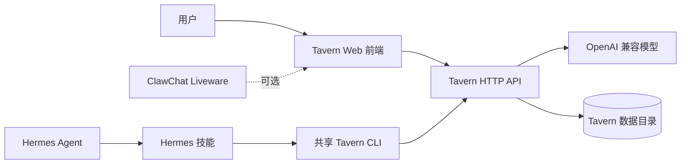

<div align="center">

# Nora's Tavern

### 为多角色 AI 故事保留一个真正持续生长的世界

一个可独立运行，也可由 Hermes Agent 操作的开源互动故事系统。

[English](README.md) · [快速开始](#快速开始) · [接入 Hermes](#接入-hermes-agent) · [文档导航](#文档导航)

[](https://github.com/LoveMaker-art/noras-tavern/releases/latest)
[](LICENSE)
[](https://www.python.org/)
[](docs/hermes.md)

</div>


Nora's Tavern 保存普通聊天界面最容易丢失的部分：世界、登场角色、你的角色、触发设定、人物变化，以及经过压缩整理的剧情账本。前端只专注于当下这一幕，连续性由背后的状态系统维护。

## 核心能力

- **多角色世界**：同一场景中包含你的角色、登场角色、世界书、触发设定和持久会话。
- **长剧情连续性**：按阶段整理剧情账本，并以结构化方式更新长期角色状态。
- **角色卡兼容**：对常见 Tavern / SillyTavern 角色卡数据进行解析和标准化导入。
- **完整故事交互**：继续、重生成、编辑、智能回复、文本模型选择和语音播放。
- **世界视觉风格**：每个世界可独立设置桌面与手机背景、字体、颜色和阅读表面。
- **Agent 驱动**：Hermes 可通过技能创建世界、导入素材、管理模型、检查状态和更新应用。
- **代码与数据分离**：发布更新不会覆盖用户故事、角色、模型密钥或上传素材。

## 界面预览

| 手机沉浸阅读 | 世界与角色工作区 |
| --- | --- |
|  |  |

同一个世界既可以在手机上专注阅读，也可以在桌面端查看角色、世界设定、素材库、模型与故事档案。

## 选择部署方式

本项目只有两条主要安装路径：

| 我想要…… | 从这里开始 | 会安装什么 |
| --- | --- | --- |
| 只玩酒馆 Web 应用 | [路径 A：独立酒馆](#快速开始) | 只安装 Tavern，不需要 Hermes、ClawChat 或 Liveware |
| 让 Agent 创建并管理酒馆世界 | [路径 B：Hermes + Tavern](#接入-hermes-agent) | 先安装 Hermes，再安装 Tavern 应用和 Hermes 技能 |

ClawChat Liveware 只是路径 B 的可选展示入口，不是第三套运行方式。独立 Tavern 和普通 Hermes 用户都不需要安装 Liveware。

## 快速开始

### 路径 A：独立酒馆

需要 Python 3.10+，以及一个兼容 OpenAI Chat Completions 的模型接口。

```bash
git clone https://github.com/LoveMaker-art/noras-tavern.git
cd noras-tavern
python3 start.py
```

首次启动会询问模型接口、API Key 和模型 ID，并自动创建本地环境、安装依赖和保存
`.env`。以后仍然只需运行 `python3 start.py`。Windows 可以使用 `py start.py`。

终端显示 `Tavern → http://127.0.0.1:8799` 后，打开该地址。不要直接双击
`app/frontend/index.html`；静态页面无法连接后端，会显示“无法连接酒馆后端”。运行数据只写入
`TAVERN_STATE_DIR`，不会写回源码目录。

正式部署、反向代理、环境变量和数据目录说明见[独立部署](docs/standalone.md)与[配置参考](docs/configuration.md)。

## 接入 Hermes Agent

### 路径 B：Hermes + Tavern

Tavern Bootstrap **不会安装 Hermes Agent**。请先按照 Hermes 官方的[安装指南](https://hermes-agent.nousresearch.com/docs/zh-Hans/getting-started/installation)和[快速入门](https://hermes-agent.nousresearch.com/docs/zh-Hans/getting-started/quickstart)完成 Hermes 安装与模型配置：

```bash
curl -fsSL https://hermes-agent.nousresearch.com/install.sh | bash
hermes setup
```

使用 Nous Portal 时，官方提供的最短配置方式是 `hermes setup --portal`。添加 Tavern 前，请先打开 Hermes，完成一次能够正常返回内容的真实对话。

Hermes 工作正常后，再安装或更新 Tavern 应用、完整 Hermes 技能和受管理的集成文件：

```bash
curl -fsSL https://github.com/LoveMaker-art/noras-tavern/releases/latest/download/install-tavern-updater.sh | sh -s -- --apply --confirm
```

更新器会检查发布清单与兼容性、创建回滚材料、应用受管理文件，并在完成后执行健康检查。世界、角色卡、故事、模型配置、身份与上传素材都不在覆盖范围内。

安装完成后验证：

```bash
hermes skills list
python3 "${HERMES_HOME:-$HOME/.hermes}/skills/creative/tavern/scripts/tavern_cli.py" doctor --json
curl -fsS http://127.0.0.1:8799/api/health
```

验证通过后，可以让 Hermes“创建一个酒馆世界”，也可以直接打开 `http://127.0.0.1:8799/`。

完整 Tavern 集成目前面向 Linux、macOS 和 WSL2，因为受管理的运行脚本依赖 POSIX `sh`。原生 Windows 用户可以使用 `py start.py` 独立运行 Tavern。

如果 Tavern 已经运行，只需要技能，可按 [Hermes Custom Tap 指南](docs/hermes.md#已有-tavern只安装技能)单独安装。

## 系统关系



前端与 Hermes 技能通过同一套 Tavern API 和状态数据工作。Agent 不直接改生产 JSON，而是通过共享 CLI 与 HTTP 边界完成操作。

## 仓库结构

```text
app/backend/             Tavern 后端源码
app/frontend/            Tavern Web 前端源码
app/assets/              内置模板与运行资源
skills/                  Hermes Custom Tap 与共享 CLI
integrations/hermes/     可选 AGENTS 与 SOUL 模板
tools/                   可移植的 Tavern CLI 入口
bootstrap/               带校验的更新器 Bootstrap
docs/                    部署、配置与架构文档
scripts/                 发布构建工具
tests/                   后端、前端、更新器与边界测试
```

源码仓库不应包含任何用户世界、角色卡、聊天记录、密钥、ClawChat 会话或注册数据。

## 文档导航

| 文档 | 内容 |
| --- | --- |
| [独立部署](docs/standalone.md) | 不使用 Hermes 的本地与服务器安装 |
| [Hermes 部署](docs/hermes.md) | 技能、路径、Hook、ClawChat 与更新 |
| [配置参考](docs/configuration.md) | 模型、存储、安全与性能 |
| [项目架构](docs/architecture.md) | 运行边界、状态、API 与发布设计 |
| [参与贡献](CONTRIBUTING.md) | 开发流程与 Pull Request 规范 |
| [安全策略](SECURITY.md) | 漏洞报告与密钥处理原则 |

## 开发与测试

```bash
PYTHONPATH=app/backend python3 -m unittest discover -s tests -v
node --test tests/frontend_security.test.js
python3 scripts/build_release.py
```

修改运行边界、状态迁移、更新器清单或共享技能前，请先阅读 [CONTRIBUTING.md](CONTRIBUTING.md)。

## 开源协议

Nora's Tavern 采用 [GNU AGPL-3.0-only](LICENSE)。通过网络提供修改后的版本时，需要按 AGPL 第 13 条向用户提供对应源码。

`v1.18.1` 及更早版本仍按当时随版本附带的 MIT License 发布。
