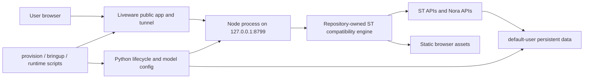
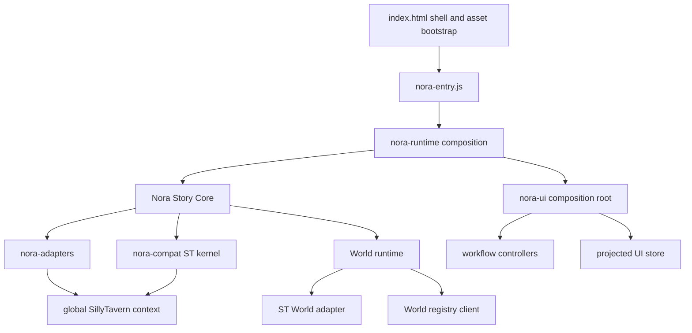

# Nora Tavern Current Architecture

> Latest implemented overlay: [release hardening, 2026-08-30](RELEASE-HARDENING-2026-08-30.md).
> Its runtime-ready event, serialized Store commits, request deadlines, embedded
> Profile build contract and guarded release flow supersede the older details below.

> Historical snapshot notice (2026-08-30): the body below describes an earlier
> candidate and overlay, not the current `main@9f0ba72`. Its flat-bridge,
> retired imports-route and passing-suite statements are not current assertions.
> Read [the current release audit](TAVERN-RELEASE-AUDIT-2026-08-30.md) for verified
> architecture, regressions and remaining release gates.

## Snapshot and evidence boundary

This document describes the effective local release-candidate worktree on
2026-08-29 after reconciling the target runtime back into Git. The exact Git
HEAD, overlay and per-file hashes are generated in `project-index.json`; the
deployed identity is recorded separately because a document cannot embed the
hash of the commit that contains itself.

The current worktree is materially different from HEAD. Exact tracked,
modified, untracked, and deleted counts live in the regenerated
`project-index.json`; they are not duplicated here because this document is part
of the indexed worktree. Architecture claims below distinguish the committed
baseline from the current overlay where that distinction matters.

Evidence levels reached by this analysis:

- **Analyzed:** source, configuration, generated bundles, tests, lifecycle, and
  operations paths are mapped below.
- **Indexed:** the structural graph was refreshed and a separate SHA-256 index
  was generated at `docs/architecture/project-index.json`.
- **Implemented:** startup ownership, World Core v2-only online routing,
  critical-asset packaging, chat backup transactions and batched OpenAI token
  counting are present in source.
- **Technically verified:** the current production build, complete Nora behavior
  suite, architecture contracts and dependency-graph checks pass. Exact counts
  belong in the execution review generated with the candidate.
- **Partially user-outcome verified:** prior remote evidence covers process cold
  start, HTTP asset delivery and World backend operations. The five browser
  product workflows remain the active acceptance scope.
- **Deployed baseline:** the target runtime has World v2 as its sole online World
  route; the reconciled release candidate in this worktree is not claimed as the
  deployed revision until the final deployment report records matching hashes.

## Source-of-truth hierarchy

The repository contains four different kinds of material. Treating all four as
equally authoritative is a major source of confusion.

| Priority | Material | Authority |
| --- | --- | --- |
| 1 | `app/engine/sillytavern/src`, `app/engine/sillytavern/public`, `app/native-extensions`, `app/*.py`, `ops`, sibling `../story-profile` | Authored source and runtime operations |
| 2 | `package.json`, lockfile, Webpack config, asset generator, extension manifests, ADRs | Build and architecture contracts |
| 3 | `public/dist/nora`, `public/lib-core.js`, `JS-Slash-Runner/dist`, `app/story_profile_runtime` | Shipped generated output; must be reproducible from source |
| 4 | `local-state`, `release`, installed third-party extension copies, dependency/vendor trees | Mutable state, release copies, or duplicates; not source |

The sibling `../st-mcp` project owns the MCP control plane and its upstream
SillyTavern reference index. It is not part of this Tavern repository index.

## Operational topology

Nora Tavern has one serving process. Python is lifecycle tooling, not a second
application server.



The operational sequence is:

1. Explicit first installation uses `provision.sh`; it alone may create missing
   Tavern / Story Profile App identities. Queries fail closed and confirmed IDs
   are persisted separately. Ordinary upgrade and startup never create Apps.
2. `ops/hooks/tavern-liveware-register` and `bringup-native.sh` use the shared
   installation lock and existing-only `liveware_integration.py` path. An
   unfinished update blocks startup. They do not synchronize model settings.
3. Upgrades reconcile the two saved IDs within the update journal. Tavern binds
   to the local root; Story Profile binds to `/_liveware/story-profile`. Launcher
   metadata and local role-specific HTML/icons are checked separately from
   actual external routing, which the installed CLI cannot independently read.
4. `app/native_lifecycle.py` verifies the pinned engine contract, prepares Node
   dependencies, renders configuration, installs the repository-owned native
   extensions into the user data tree, and launches `node server.js`.

The lifecycle health check uses `/csrf-token`. That demonstrates that Express is
listening and a basic endpoint responds. It does **not** demonstrate that the
browser module graph, ST application initialization, World hydration, composer,
or first usable frame works.

## Server architecture

### Entry and startup

The server entry chain is:

```text
server.js
  -> command-line parsing
  -> dynamic server-main.js
     -> configuration and security middleware
     -> static asset and template setup
     -> ST endpoint registration
     -> Nora endpoint registration
     -> pre-setup migrations/settings/plugins
     -> Webpack compatibility build
     -> listen
     -> post-setup tasks
```

`src/server-main.js` synchronously reads
`public/dist/nora/inline-modules.js` during process initialization. The body is
still JSON, but the cacheable JavaScript suffix lets Liveware treat this critical
bootstrap payload as a static asset. Core files and third-party extensions use
separate content-addressed release identities, so an extension change does not
invalidate the full core asset set. The server waits for its Webpack middleware
compiler before listening.

### API ownership

The compatibility engine retains its existing settings, card, chat, world-info,
secret, prompt, and provider endpoints. Nora adds four route groups in
`src/server-startup.js`:

| Route | Owner | Responsibility |
| --- | --- | --- |
| `/api/nora-boot` | `endpoints/nora-boot.js`, `nora-bootstrap.js` | Aggregated startup payload |
| `/api/nora-worlds-v2` | `endpoints/nora-worlds-v2.js`, `nora-world-core/*` | Authoritative World operations, projections and open plans |
| `/api/nora-imports` | `endpoints/nora-imports.js`, `nora-import-registry.js` | Native import journals |
| `/api/nora-mvu-model` | `endpoints/nora-mvu-model.js`, `nora-mvu-model-config.js` | Separate MVU model configuration |

The bootstrap endpoint reads characters, runtime model settings, secret state
and version concurrently. It does not scan recent chats, reconstruct a World or
select an initial World. Initial World selection is owned by the World v2 UI
controller from the authoritative World list plus the persisted Nora UI
`lastWorldId` preference.

### Data ownership

The active runtime is single-user and maps requests to `default-user` through
`src/workspace.js`.

| Data | Canonical owner | Persistence |
| --- | --- | --- |
| Characters/cards | ST compatibility engine | user character directories |
| Chat messages and chat metadata | ST compatibility engine | JSONL chat files |
| Canonical World identity and projection | Nora World Core | `nora-world-core/worlds/*.json` |
| Active World UI preference | Nora UI settings | `extension_settings.nora_ui.lastWorldId` |
| Worldbooks | ST compatibility engine | user world-info directories |
| UI/startup settings | ST settings | `settings.json` extension settings |
| Secrets/provider credentials | ST secret store | user secrets file |
| Import state | Nora import registry | `.imports/imp_<digest>.json` |
| MVU model override | Nora MVU config | `nora-mvu-model.json` plus secret key |
| Lifecycle/runtime markers | Python lifecycle | `tavern-state/native-runtime` |

World Core owns Nora identity and resource bindings; ST remains the persistence
engine for card files, chat JSONL and Worldbook contents. Opening a World obtains
an immutable open plan from World Core and then activates those ST bindings in a
browser transaction. Offline `legacy-migration.js` may project old data into
World v2, but no legacy reader participates in normal startup or requests.

## Browser and product runtime

### Intended module boundaries



The intended boundaries are coherent:

- `nora-compat` is the compatibility kernel and the only place that should
  acquire the raw global ST application contract.
- `nora-adapters` translates raw ST context into named domains: state, messages,
  cards, worldbook, model, MVU settings, settings, and transport. The MVU
  settings domain controls either an embedded card runtime or Nora's managed
  runtime without exposing the raw ST context to product UI.
- `nora-story-core` composes the kernel, adapters, World runtime, and registry.
- `nora-worlds` owns World lifecycle transactions and projections.
- `nora-ui/index.js` is a composition root; workflow controllers own character,
  message, World, Worldbook, model, panel, shell, scrolling, and creation flows.
- `nora-mvu` and `JS-Slash-Runner` are managed native extensions that execute
  compatibility features behind the ST extension surface.

The Story Core still exports a documented “temporary flat bridge” named
`runtime` for the existing UI. The named domain interfaces are the intended
surface, so the flat bridge remains transitional coupling rather than a final
deep-module boundary.

### Intended startup lifecycle

The intended browser lifecycle is:

```text
HTML early shell
  -> acquire runtime assets and bootstrap data
  -> execute the ST core module graph
  -> globalThis.SillyTavern.getContext becomes available
  -> ST emits APP_READY
  -> Story Core and adapters become available
  -> Nora UI mounts
  -> hydrate characters/chats/Worlds
  -> select and activate the initial World transactionally
  -> messages and composer become usable
  -> emit nora:usable only after those conditions hold
```

World activation is designed as an all-or-nothing transaction:

```text
snapshot current character/chat/persona
  -> select target character and chat
  -> verify resulting context
  -> persist missing nora_world.id metadata
  -> verify persistence
  -> update persona and World registry projection
  -> commit
failure at any stage -> restore previous snapshot
```

Import journals have the smaller state machine `staged -> imported`; failures
increase the attempt count and persist `last_error` without inventing a success
stage.

## Current asset build

`webpack.nora.config.mjs` emits three module bundles: `entry`, `lib-core`, and
`lib`. `build/generate-nora-runtime-assets.mjs` walks the native browser-module
graph, minifies the 137 modules that require native ESM cycle behavior, converts
those modules to data URLs, adds path aliases and four network fallbacks, and
emits compressed copies.

Legacy libraries and `lib-core` are not duplicated inside the manifest. They
are standalone content-addressed immutable assets, requested in parallel with
the critical manifest. The browser HTTP cache is the only persistent asset-cache
authority; the previous CacheStorage plus IndexedDB coordination was removed.

Current generated output:

| Asset | Raw bytes | Brotli bytes | Gzip bytes |
| --- | ---: | ---: | ---: |
| `entry.js` | 481,594 | 129,547 | 163,214 |
| `inline-modules.js` | 2,446,103 | 523,190 | 754,080 |
| `legacy.js` | 482,417 | 112,679 | 132,899 |
| `lib-core.js` | 803,590 | 204,766 | 250,248 |
| `lib.js` | 915,054 | 234,125 | 284,028 |

The manifest remains substantial because the compatibility engine has 137
native ESM modules whose cycle semantics have not been replaced by an unverified
bundler transformation. Its Brotli size is now enforced below 550 KB. Further
reduction requires deferring actual ST feature imports or proving a cycle-safe
core bundle in a real browser compatibility suite.

## Startup defect and implemented correction

The startup graph break was introduced in the uncommitted overlay rather than
the committed HEAD.

At HEAD, `public/scripts/nora-compat/st-kernel.js` directly performed:

```js
await import(/* webpackIgnore: true */ '/script.js');
```

That import executed the ST core entry. `public/script.js` publishes
`globalThis.SillyTavern = { libs, getContext }` and later runs
`firstLoadInit()` from its jQuery-ready path.

The defective overlay removed that import and replaced it with a
10-second wait for both `__NORA_ST_CORE_READY__` and
`globalThis.SillyTavern.getContext`. Meanwhile, `public/index.html` creates an
inline module that imports only four helper modules and then sets
`__NORA_ST_CORE_READY__ = true`. It does not import or execute `script.js`.
Defining `script.js` in an import map does not execute it, and the generated
`entry.js` contains no import of `/script.js` or `nora-module/script.js`.

The broken graph was:

```text
index.html declares helper modules ready
  -> entry.js starts Nora runtime
  -> st-kernel waits for globalThis.SillyTavern.getContext
  -> no source-level edge executes script.js
  -> global contract is never created by this graph
  -> wait can only expire after 10 seconds
```

The current correction restores `st-kernel.js` as the single execution owner,
removes HTML's false readiness flag/event, and verifies the global API after
module evaluation. `nora-core-execution-contract.mjs` asserts that exactly one
source-level execution edge exists. The production bundle contract now requires
that edge instead of prohibiting it.

`nora:usable` now fires only when an active World, rendered-message state, and
enabled composer are all present. This prevents a blocked activation from being
reported as user-usable.

## Architecture and quality assessment

### Sound or directionally sound decisions

- One Node serving process has clear operational ownership.
- Raw ST compatibility is intentionally isolated behind kernel/adapters.
- World activation has explicit snapshot, verification, persistence, and
  rollback semantics.
- Product-visible Nora identity is separated from compatibility identifiers.
- UI workflows have been split into controller modules with a central store and
  composition root.
- World and import registries use normalized documents and atomic writes.

### Resolved structural problems

1. ST core execution has one owner at the compatibility boundary.
2. HTML no longer claims readiness for a core it did not execute.
3. Startup contracts require an executable edge and a 550 KB Brotli manifest
   budget.
4. `nora:usable` proves active World, messages, and composer postconditions.
5. Legacy and compiled core libraries are no longer duplicated as base64 inside
   the manifest.
6. CacheStorage and IndexedDB no longer compete with the immutable HTTP cache.
7. The server no longer synchronously parses the multi-megabyte manifest merely
   to render its content-addressed URL.

### Remaining structural problems

1. **Large native module graph.** The remaining 2.38 MB raw / 504.6 KB Brotli
   manifest still requires JSON parsing, data-URL allocation, and compilation of
   137 modules before the compatibility core can initialize.
2. **Compatibility capability activation is still variable.** Complex-card
   helpers can take seconds and must remain outside base World usability while
   exposing READY/DEGRADED evidence.
3. **No complete browser-level product gate.** Static contracts, unit tests, and
   server smoke tests do not execute complex cards, MVU, APP_READY, World
   activation, model generation and persistence as one release workflow.

The card library no longer expands every Runtime Card before rendering a page.
It uses the shallow character projection for list and pagination, then expands
only the selected detail. The backend shallow projection is still O(card count)
and should gain a separate read index only if target measurements prove it is a
startup bottleneck.

### Performance interpretation

The observed tens-of-seconds startup cannot be responsibly reduced to “code is
large” or “the server is slow.” The architecture contains multiple independent
latency classes:

- tunnel/server time-to-first-byte for startup assets;
- manifest transfer and decompression;
- JSON parse, data-URL allocation, and module compilation;
- authoritative World list/open-plan requests and ST activation;
- optional compatibility capability readiness; Nora has no legacy ST UI hydration phase.

Remote timings must be mapped to an exact release hash before assigning their
weight to these causes. This document establishes the local dependency graph;
the next performance phase must measure this exact content hash through the
Liveware path before attributing the remaining time.

## Remaining verification and optimization order

1. Fix the release candidate identity and deploy only that candidate.
2. Verify deployed hashes and measure cold and warm navigations.
3. Keep initial shell, bootstrap, active World, and composer on a measured
   critical path; defer reconciliation and non-active capabilities.
4. Execute the five product workflows in a browser gate and assert
   `SillyTavern.getContext`, `APP_READY`, active World, messages, composer,
   generation, edit/regenerate, library import and restart recovery.
5. If the measured target still exceeds 5–10 seconds, profile the remaining 137
   modules and split features only where runtime evidence shows a critical-path
   dependency can be deferred safely.
