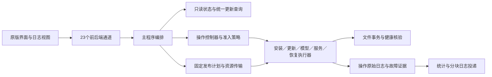

# 启动器可靠性交付设计与执行方案

日期：2026-10-04，阶段记录更新至 2026-10-08。状态：S0/S1 完成；S2 既有日志链路与生产闭环已验，本轮模型助手与原生崩溃诊断补齐见9.12，新客户端正式交付待 S7；S3 GitHub 优先、SourceForge 备用的客户端与发布代码已技术验证，旧稳定版目录及资源已可读取，自动上传凭据已配置并通过真实只读连接；S4 源码修订、两端真实旧版本升级及更新硬中断恢复已验，其他退出项待验；S5 配置缺失引导已修订并进入测试包，Mac 真窗部分交互已验，Windows 视觉和真实账号配对未验；S6 已有测试包证据仅适用于对应源码身份，后续修订须重新构建；S7 未到达。整体功能交付尚未完成。

这是当前重构启动器的唯一执行方案，统一维护范围、阶段、验收条件和阶段结论。[安装、更新与恢复](launcher-unified-update.md)、[共享业务归属](launcher-shared-logic.md)、[诊断协议](launcher-install-diagnostics.md)说明机制，不另维护实施进度。过期方案、重复快照和一次性脚本已永久删除；必要验收报告保留为证据，不作为活动任务列表。

## 1. 产品结果与范围

用户应能安装、更新和继续使用诺拉；失败时知道发生什么、数据是否安全、可以执行什么操作。维护者应从接收端取得足够的脱敏证据，区分代码、网络、系统条件和外部服务故障。未知原因如实说明，不能猜测原因或把用户困在无限重试中。

本轮基于现有重构完成可靠性交付，不从零重写，不为整理方案增加运行服务。

| 处理 | 范围 |
| --- | --- |
| 保留 | Electron 外壳、现有主页面、安装/配置/更新/恢复/日志/卸载入口；统一操作管理、原生互斥、文件事务、故障证据与投递实现 |
| 修正 | 已复现的执行、路径、交接和状态缺陷；错误归类、允许动作、诊断送达和完整包验证不足；错误阻挡正常使用的非权威状态校验 |
| 补齐 | 可信主备资源来源及客户端接入；当前候选的关键跨平台流程；旧启动器不能启动时的保留数据更换路径 |
| 收敛 | 并行方案、重复快照、一次性测试入口、重复失败归类和测试环境；在已有职责内处理，不叠加第二套执行器 |
| 补充确认 | 用户后续明确要求启动器内查看实时原始日志；沿用原版右侧任务区切换，按下文控制台约定实施 |
| 暂停 | 新监控页面、独立运维面板、额外视觉改版、与可靠性无关的功能 |
| 不修改 | 世界、聊天、用户模型选择和凭证、自定义内容、外部 Hermes 实例、酒馆业务和 Hermes 上游 |
| 单独决策 | 分发节点域名、存储、费用和上线；版本号、签名/公证、推送与发布。本任务不执行生产动作 |

基础统计持续上报操作阶段、耗时、运行状态和固定错误码，不受详细诊断开关影响。不以识别同一用户为目标。沿用用户最新确认的详细诊断选择：新选择默认开启，保留已有主动关闭；关闭后停止额外故障投递，基础统计继续。统计下载请求成功即可，不增加浏览器最终下载完成追踪。

容灾承诺：受支持流程发生软件失败或进程中断时，保留用户数据并提供经核验的恢复路径。不承诺磁盘损坏、数据与备份同时丢失后必然恢复，不承诺外部网络永不失败。

## 2. 当前事实

| 事实 | 已达到的证据 | 不能推断的结论 |
| --- | --- | --- |
| 当前 Mac ARM 完整候选 | c508 对应 APP 实际首装、本地健康、本地模型 HTTP 与保存投影通过；关闭/重开前后各 8 次查询通过 | 真实远端模型、ClawChat 配对、生产资源下载或所有更新/恢复场景通过 |
| 以前的 Mac/Windows 候选 | 真实原生执行、首装、模型 A→B、部分更新/强退恢复报告 | 保留原候选身份；只在相关字节未变且修改不影响流程时限定复用，不改标成当前包全部通过 |
| 版本身份 | 已有候选沿用启动器 2.0.2 / 系统 2.4.2；新源码准备为启动器 2.1.0 / 系统 2.4.3 | 新版本尚未发布，不把旧候选验收改记为新版本结果，不覆盖已发布同版本资源 |
| 功能交付 | 整体尚未验收 | 不能称已交付或所有历史报错已修复 |
| 原测试 HTTP 400 | 原服务未保存拒绝断言；同源码后续请求成功 | 原因仍未知；后续成功不能证明原失败是测试脚本问题 |

当前 Mac 证据身份：源码快照 `c508c7f6a8d28d6aaba1c578d4d9ce900720b303af63f7c7dbbea5787c3c424c`；APP ASAR `5f26ca925b2188261c51edae43c2d825d9843cdb7a732f9bc1697f70999482a2`；首装操作 `88e39c85-0555-406c-9039-6891a6f87fe9`。这些值只描述对应证据，不认证后续改动。

保留现有核心继续收敛。目前没有证据要求再次全量重写。只有复现证明当前总体操作/事务模型无法表达正确恢复结果，或必要修改持续突破数据保护，才提出具体局部替换设计；不能因一个新报错扩大重构范围。

## 3. 现有架构的设计约束

### 3.1 一次维护只有一个总体操作

用户动作、技能更新与恢复入口共用 `operation-state.js` 和 `operation-policy.js`。固定 operationId、目标版本、程序身份、发布清单和尝试事实；文件效果来自各自事务，不能靠页面阶段文字推断。

根执行者取得一次原生锁，必要子执行者经既有委托握手进入同一操作，不重取总体锁。受管写者实际关闭后才释放。只读查询有有限等待，不自动修复、不创建第二个写者；历史记录数量和回复大小不能破坏正常状态查询。

总体结果同时表达文件效果与运行验证：

- 原安装未改动：原版本保持可用，失败原因和允许动作明确。
- 新文件提交且健康确认：成功，版本、receipt、运行事实一致。
- 旧文件恢复且健康确认：已恢复旧版本，保留失败证据。
- 旧文件恢复但启动失败：准确显示两个事实，允许有限启动/查询，不能称恢复后可用。
- 修改/恢复状态未知：保留文件和备份、停止覆盖，只提供核验、日志及受支持恢复入口。

不增加第二套状态文件、重复执行器或按中文文案判断动作来掩盖状态不一致。

### 3.2 实现归属与接口

| 职责 | 现有归属 | 接口需要保证的事实 |
| --- | --- | --- |
| 版本/资源选择 | `deployment/update/releases.js` | 通道、版本、平台、协议、固定内容身份；查询时间准确 |
| 网络传输 | `launcher/desktop/release-network.js` | 有限预算、实际字节、完整校验、取消、来源 |
| Hermes 准备/恢复 | `runtime-transaction.js` / `runtime.js` | 同身份归档、准备树、备份、目录身份与恢复 |
| 首次安装 | `deployment/install/first_install.py` | 后段失败纳入总体操作，配置/receipt 不产生假完成 |
| 系统更新 | `deployment/update/update.py` / `recovery.py` | 变化组件、原服务目标、文件交换与原状态恢复 |
| APP 更换 | `launcher-update.js` / `replace-launcher.py` | 助手资源闭合、旧写者结束、新 APP 同操作接管、最终验证后提交 |
| 进程/模型 | `services.py` / `model_config.py` 与酒馆既有生命周期 | 真实归属、正确环境、实际模型解析、保存与同步的不同事实 |
| 错误/诊断 | `operation-result.js`、`error-presentation.js`、`evidence-store.js`、`operation_evidence.py`、`fault-packet.js`、`telemetry.js` | 首因保留、允许动作、隐私、持久投递结果 |

接口修正在这些归属内完成。只对真实可变职责设计模块接口，不为测试或未来假设建立通用插件框架。不把测试辅助进程交付给用户，不因测试方便增加生产子进程。

### 3.3 权威事实与发现提示

程序清单、安装身份、用户配置、活动目录交换、受管备份与真实进程归属是修改前必须核验的事实。旧 PID、查询缓存、已完成历史记录是发现提示；过期不能直接判定安装损坏。

沿用 [ADR 0014](adr/0014-repair-derived-operational-state.md)：受管缓存可重建，用户配置及未知目录不能自动重写/删除。正常 Node 接管需积极证明命令、目录、用户和监听归属，停止前再核验创建身份。查询权限不足不能变成按旧 PID 强杀。

## 4. 功能设计与可观察验收

### 4.1 安装稳定性

正式首装先固定可安装发布，再准备全部资源。复用已校验包内资源与完整缓存；用户现场不依赖临时 Git 克隆或不受控拉取一串开发依赖。各平台使用锁定且完整的运行时/依赖归档。

首装总体事务覆盖运行时、酒馆、Nora 内容、配置与安装记录。相同可信计划可继续已提交部分；目标变化先重新准备和核验，不能混用旧半成品。程序安装完成、模型等待配置、远端等待配对分别表达。

验收：空目录首装可用；实际文件变更的受控失败/中断能恢复或安全保留现场；重开不重复安装已确认内容；默认配置、模板和样例不覆盖用户配置。

### 4.2 更新、回滚与保留数据更换

下载、校验、准备在停止旧服务前完成。停止和切换只影响本实例；记录用户此前 Nora/Tavern 运行选择，恢复不擅自启动原本停止的服务。组件 hash 未变时复用，不重复释放不变运行时。

文件变更前保存可恢复的意图，备份保留到总体结果确认。APP 打开只证明交接，不证明系统更新完成。独立恢复资源需要完整且可核验，不依赖刚被交换走的安装代码。

受支持旧安装核验后接管；缺记录、损坏记录和活动事务分别分流。旧 APP 不兼容时不强行兼容旧执行协议；先验证覆盖更换 APP、接管原数据的路径。若需保留数据卸载再装，必须证明真实 NSIS/APP 行为保护数据，不能只改提示。

验收：准备失败旧版可运行；正常更新数据与原服务选择保持；APP 交接、目录交换、配置/receipt 提交及最终确认前后的中断可恢复；恢复再中断可重新核验；坏备份/未知现场不覆盖。事务切点以合同检查覆盖，代表性真实强退在目标平台验证。

### 4.3 网络与多分发点

S1 基线的 `releases.js` 从 GitHub API 选择版本并严格检查 GitHub 资产地址；有限重试和缓存不构成多源落地。S3 在共享传输模块中补齐目录与文件来源映射，保留这些 GitHub 地址作为发布内容身份。后续按用户确认采用 GitHub 优先、SourceForge 备用，取代下段原主节点建议；接入及实际节点证据见 9.10、9.11。新客户端尚未部署，不能称新客户端多源已上线。

推荐最小方案：一个项目受控的发布目录/资源节点作为主来源，GitHub 为同内容备用来源。受控发布流程先上传不可变资源并核验，再发布完整平台目录。只有资源闭合的平台版本可选。需要时增加有优先级的受控来源，首轮不建立多节点调度服务。

在已有选择/传输模块内接入：

1. 从明确受信任来源取得版本目录、清单、大小和 hash。镜像自行提供的 hash 不替代发布信任。查询目录和大文件均有备用路径。
2. 固定版本与内容后冻结计划；换源只改变传输地址，不重选版本、不悄悄降级。
3. 连接失败、超时、可重试服务异常或有证据的限流触发有限切换。证书错误、内容损坏、协议不匹配、普通权限拒绝分类报告，不无限换源掩盖。
4. 现有单源读取最多三次并有总预算；多源共用一个总预算，不能每层再乘三。资源按配置来源顺序尝试一轮，耗尽有明确结果，取消终止请求和退避。
5. 同源续传沿用强 validator、Range 与完整 hash；首轮跨源从零下载，不拼接不同来源部分内容。
6. 展示资源、阶段、有效字节和已知总大小。未知大小只显示已收量。下载连续三分钟无有效新增字节才提示网络/代理；解压、拷贝、校验用自身进度，不显示 GitHub 下载故障。

验收：主源故障可从备源取得同一资源且完整校验；主备均失败有有限结果、旧版不停止；目录不一致/平台缺资源/hash 错误不安装；取消有效；旧缓存不称最新。受控 HTTPS fixture 证明客户端策略，实际域名/资源/换源实测后才称多源上线。

节点地址、受控发布凭据、存储及费用待决策。客户端可先完成，线上生效需落实基础设施。公共代理列表或“使用魔法”不替代本项设计。

### 4.4 完整故障证据与接收闭环

同一操作应能还原：实际包身份、目标版本、阶段、资源来源/传输、受控子进程退出/信号、首异常与原因链、限定技术输出、恢复结果和投递状态。未知 Windows 10061、native basic_string 需具体证据，不能只记录通用 exit1。

受限证据先持久保存，再回滚/清理。采集、裁剪、无法写入、生产者缺字段分别标记。不读取聊天、世界正文、模型回复或 Hermes 日常日志；不上传 Key、鉴权头、配对码和用户路径。恢复错误不能覆盖首因。

故障包沿用有界脱敏合同，用于快速归类。2026-10-04 用户补充确认：控制台与接收端均需要整次操作的脱敏原始执行记录，不能以最后十二条输出替代；整次日志自动上传限定在失败或异常中断，成功操作只发送基础阶段、耗时和结果。执行中的原始记录留在本地供控制台查看，不在尚未确定结果时提前上传。S2 按原操作编号分段传输/查询失败日志；与故障摘要区分，日志分段不计作新的报错事件，不污染漏斗。既有本地诊断记录为唯一日志来源，增加持久投递游标，逐段 ACK/去重，断网重开续传；接收端扩展接收/存储/鉴权查询合同，不增加监控页面。部署另获授权，不先发布不兼容客户端。

详情选择在操作开始时固定；关闭立即取消并清除待报详情，基础继续。只上传程序执行记录，不读取聊天、模型回复、配置全文或日常服务日志。原始记录只做必要脱敏，保留换行、缩进和调用栈；错误摘要在回滚前保存，整次日志在自动恢复和最终结果记录后结束。基础统计的 ACK 不代表原始日志发完；基础队列空后仍能补传原始日志，未确认送达时不能归档掉首因证据。同一操作重试或恢复后再次失败，使用独立日志快照编号，不能覆盖此前已确认的分段。源日志轮转、输出超过容量或保存失败须明确标记不完整，不伪造“完整”。本地沿用各三份 10 MiB 轮转；远端每份日志快照最多 4096 段、每段 16 KiB。完全离线、磁盘满和两份本地日志都不可写时如实标记缺失，不能承诺一定完整。

验收：唯一隔离 operationId 的真实受控失败，核对本机保存、线上 ACK、入库和按原 operationId 查询的字段/时间线；验证离线重开、部分 ACK/重复、关闭选择和裁剪。队列空、查询 200 或旧版数据不证明新版入库。保留本轮事件，不删除真实用户事件。

**控制台交互确认（2026-10-04，用户最新指令）。** 保留原版人物图、整体排版与固定窗口；右侧处理区可切换为详细日志。处理页保留错误解释、恢复等操作和诊断选择，日志页只保留返回、复制及原始文本。日志区内部使用滚轮连续阅读，不再采用上一页/下一页；此决定取代此前原型分页及“不用滚轮”的解释，整个窗口仍不向下拉长。新输出默认跟随末尾，回看历史时暂停跟随并可回到最新；失败时定位原始错误，复制包含完整本次记录。启动器自身输出采用清晰的文本级别/阶段/结果，子程序输出及调用栈保留原样并仅作必要脱敏，内部事件 JSON 不直接作为全部控制台文本。当前已调整隔离原型，真实采集、读取、投递和 UI 接入仍待 S2/S5 实施验收；不因此标记阶段完成。

### 4.5 引导、按钮与必要排版

保留现有界面。错误页说明发生什么、安装/数据的确认事实、下一步动作。技术详情放日志或标识的展开内容；未知原因明确说未确认，提供关联诊断的操作编号。

| 真实情况 | 用户引导和动作 |
| --- | --- |
| 查询/下载失败、旧版未动 | 检查网络/代理，有限重新检查，保留旧版入口 |
| 403 | 区分有证据限流和拒绝；无证据不称 GitHub 配额耗尽，不要求改模型 Key |
| 模型鉴权/协议/地址异常 | 指向相应输入/权限，保留填写内容；已保存未同步可继续同步 |
| 有完整可信恢复记录 | “恢复旧版本”，点击复核并保留失败现场 |
| 文件恢复但启动未确认 | 说明文件恢复；有限启动/查询，不说恢复可用 |
| 记录/归属/备份未知 | 保全现场，核验/日志及受支持保留数据更换引导 |
| 同目标与条件连续失败两次 | 停止普通重试，调整条件后核验；重开和技能不清零 |
| 后台仍写入 | 等待和日志，不能并发恢复、重装或卸载 |

网络失败不能一概让用户对诺拉说“更新”：技能走同一执行器与来源，不能绕过次数/校验。按钮来自后端允许动作，不由文案猜测。失败后结束“正在处理”，或明确后台未结束事实；查询失败保留最后确认事实并阻止未核验变更。

排版覆盖现有窗口、Windows 缩放、长错误/路径、模型和恢复详情：主要按钮初始可见、内容可滚动、键盘可达、无横向溢出。仅改影响真实操作的布局，不开展视觉改版。

## 5. 分阶段执行与汇报

已执行 S0 资料整理与 S1 基线审计。S2 日志链路、本地核验与生产接收闭环已验收，新客户端正式交付待 S7；S3 已完成用户授权的客户端与隔离验证，实际节点待接入；S4 源码修订与隔离事务检查已完成，真实联合升级等退出项仍待验。S5 已按下述设计实施，Mac 真窗部分交互已验，Windows 视觉验收仍待办。S6 已按随后授权构建并部署两端测试包；本轮证据和限制见 9.2，S7 未执行。

| 阶段 | 工作与退出条件 | 向用户汇报 |
| --- | --- | --- |
| S0 资料与方案 | 冗余资料永久删除、有效证据核验、正式回归保留；唯一方案、问题对应、执行约束可查；代码/APP 不变 | 删除范围、保留内容、方案范围和检查结果 |
| S1 基线与接口 | 固定源/包/依赖；核对真实入口、版本、写者、状态、恢复；确证缺陷与验收缺口分开，确定最小修正清单 | 已证原因、保留实现、需改文件、未知原因 |
| S2 证据与结果 | 原生产者→持久证据→结果/动作→原版界面日志区→投递→接收查询逐段闭合；以下 S2 验收项全部有证据才完成 | 用户实际看到什么、维护者收到什么/缺什么、隐私负例、本地/线上等级 |
| S3 下载与来源 | 总预算、进度/取消/缓存、固定目标、可信主备来源 | 行为变化、来源配置/待上线项，fixture 不当线上效果 |
| S4 安装更新容灾 | 修正 S1 确证执行缺陷；首装后段、复用、APP 交接、服务计划、旧安装、数据更换及恢复切点 | 旧版/数据影响，文件与服务结果，问题结案证据 |
| S5 必要交互 | 错误路由符合后端动作；无盲重试/假完成/错误归因；真实窗口主操作可见 | 文案/按钮与条件、实测/视觉认可区别 |
| S6 固定完整包 | 冻结技术检查过的源，复用未变依赖组装完整候选；执行目标流程及线上故障查询 | 唯一包身份、每场景证据、缺设备/账户/节点 |
| S7 交付判断 | 汇总通过/失败/未验/未知根因，确定平台/路径/回退，交用户验收；发布另获明确授权 | 可用范围、风险、正式版本/资产；不提前说完成 |

每阶段开始说明范围和拟验证结果，结束说明行为变化、证据、未完成项、下一步。阻挡或结论变化及时报告，不等整轮结束。不把阶段汇报变成重复申请已授权工作。

### S2 修订执行顺序与预期效果

1. **复现证据丢失。** 使用真实受控子进程失败，沿用现有采集器、证据存储及故障包生成，建立能在当前断点失败的回归。区分生产者没输出、传递丢失、隐私省略与容量裁剪。
2. **保存和投递。** 持久化首因、原因链及错误上下文，回滚前冻结；仅在失败或异常中断后，以既有原始日志记录分段投递整次操作，补充接收端合同与数据库迁移。保存失败不覆盖原异常。恢复和重开使用同一操作编号；验证成功操作不传完整日志、离线重开、部分/重复 ACK、关闭详细诊断及容量限制。线上扩展先部署验收，客户端后发布。
3. **真实日志交互。** 沿用现有本地诊断日志，增加按操作编号的只读接口；只读自有日志及轮转，不接受任意文件路径。按上文交互确认接入原版右侧区域，实时显示真实记录、内部滚轮、失败定位、完整复制；回看历史不被新输出抢走。
4. **结果和接收核对。** 保留后端允许动作，核对首因、恢复结果和投递状态没有相互覆盖。受控失败的本地保存、发送 ACK 与接收端查询必须对应同一操作编号；未取得生产入库证据只称本地技术验证。

**用户预期效果：** 正常执行时可查看真实阶段、已有字节进度及原始子程序输出；失败时在启动器内查看原始错误和调用栈，不需翻找目录。返回处理页仍能执行已核验的恢复等动作，查看日志不触发重试或修改安装。窗口不拉长，日志不用翻页。

**维护者预期效果：** 成功操作可观察阶段、耗时和结果；失败或异常中断可查询该次操作的脱敏原始执行记录及独立故障摘要，关联程序/版本/阶段、首因及原因链、受控输出、退出/信号、文件效果和恢复结果。接收端明确返回已收段数、终结段及完整/缺失事实；不包含全部服务日志。关闭、断网、裁剪或无法写盘明确留下缺失/投递事实。

**退出门槛：** 真实生产者到持久证据和故障包的回归通过；本地只读/跨操作隔离及隐私负例通过；连续滚动、失败定位、复制和返回在目标界面验证；按原操作编号核对生产 ACK/入库/查询。未验证项逐项列出，不以测试数量代替结果，不在 S2 宣称其他历史安装/更新根因均已修复。

**S2 历史实施记录（2026-10-04 23:18，当时未达到阶段退出门槛）。** 已复现并修正受控安装 stderr 经冻结和重开后未进入 schema 2 故障摘要的断点；旧未审核输出仍不作为可信证据。整次失败原始日志使用既有诊断文件，控制台只读接口、原版任务区切换以及失败日志分段投递/接收源码已实现。独立 CLI 的日志结束点移至自动回滚和互斥释放之后，保留原始失败及实际恢复结果；基础队列 ACK 后仍可补传原始日志，未收齐日志时不能归档故障证据。成功和执行中的操作不上传整次原始日志，异常中断重开后可补报；新诊断选择默认开启、已有明确关闭选择保留。

本地验证覆盖真实 Node/Python 生产者、持久证据重开、真实 Worker 与 SQLite 迁移合同、离线/丢 ACK/去重、独立 CLI 回滚结束点、基础队列空后的续传、来源隔离与密钥负例，以及控制台处理器的跟随/暂停/复制/返回。相关 191 项检查通过、无跳过；保留输出为 `outputs/launcher-reliability-20261004/s2-focused-checks.txt`。检查使用隔离目录，Python 配置存取夹具通过已有候选的受控 venv 边界；未运行真实酒馆或 Nora 服务，未改已安装 APP。

**本地补充验收（2026-10-04 23:44）。** 实际 Electron 38 ARM 固定 1120×680 内容窗口加载当前原版页面、preload 与控制器；隔离子进程真实产生 150 条输出及退出码 7 的错误/调用栈。查看日志、滚轮回看、持续追加时暂停跟随、回到最新、复制全部及返回失败页已逐项操作核验。复制内容实际包含首条、末条、错误、缩进栈及结束结果；调用记录只有日志和状态只读接口，没有安装/更新/恢复调用。原版人物图、固定高度及错误处理入口保留，结束记录耗时重复已去重。此项证明当前 Mac 原生日志交互，不认证 Windows 缩放、完整正式安装或用户视觉认可；未运行真实 Nora/Tavern 服务，未替换已安装 APP。

主日志实际写入失败后进入备用日志、主日志恢复后的全局顺序已修正：读取时先合并文件头再推进游标；900 条跨批次/重开记录保持顺序，旧记录无法确定同时间先后时明确返回 `log_order_unknown`。真实子进程的 360 条主备交替输出经过断网、重开、丢 ACK 后进入实际 Worker/SQLite，顺序、首尾及调用栈保持，服务输出与凭证省略明确。超大记录/未完成行边界检查通过。正式包文件清单曾遗漏新增投递模块；只含清单文件的加载检查复现后，已补齐并通过，未因此提前构建正式包。

补充相关 37 项检查通过、无跳过，输出为 `outputs/launcher-reliability-20261004/s2-order-checks.txt`；原生隔离验收记录为同目录 `s2-native-check.json`。此前 191 项属于其对应源码与场景证据，不与本轮重叠项目相加。接收端原有接收、鉴权、分页、故障聚合及漏斗的 22 项检查通过；Worker 部署 dry-run 通过，生产待迁移清单仅 `0008`。这些仍属于本地技术证据。

**S2 上线前的剩余退出门槛（历史记录）：** 当时尚缺生产数据库备份、`0008` 迁移及兼容 schema 2 摘要/原始日志路由部署，随后以隔离操作编号核验真实分段 ACK、入库、鉴权与完整查询。用户当时明确先不急线上验收并授权 S3，S3 客户端继续执行不等于这些门槛已通过。下述生产验收记录说明之后获授权执行的结果；未打包、发布或推送客户端，历史未知根因仍未结案。

**跨会话联调核验（2026-10-05）。** 用户要求与“创建 GitHub 网页”会话对接接收端，已分工由本会话负责客户端、该会话负责接收端与生产状态核验。当前客户端连接实际 Worker 与隔离 SQLite 的四组相关回归共 82 项通过、无跳过，覆盖真实原始输出、调用栈、离线重开、丢 ACK 去重、详细关闭及成功操作边界；此轮不与此前检查数量相加。报告 `s2-joint-client-checks.txt` 与输入身份索引 `s2-joint-client-verification.json` 保存在既有证据目录。

接收端交叉核对修正了新日志接口与故障统计 HMAC 命名空间不一致的问题，现可使用故障记录返回的安装标识查询同次日志；另修正不存在的快照缺失反馈、整份日志省略原因汇总以及末尾查询游标边界。接收端 28 项相关检查和部署 dry-run 通过；本会话补充实际客户端“故障统计安装标识→同操作/log_id→原始调用栈”路径，修订后四组 82 项再次通过、无跳过。初轮新增查询检查没有推进夹具时钟，基础事件受发送冷却限制未入库；按既有时钟推进后通过，该初轮记录保留，不计作新的产品故障。

双方输入 hash 已核对一致；完整交接结果为 `s2-receiver-handoff.json`，修订后的客户端报告为 `s2-joint-client-final-checks.txt`。当时生产只读核验确认已应用至 `0007`、`0008` 待应用且日志表尚不存在；兼容部署候选、源代码差异与 Worker 回退步骤已准备。上线须先取得生产授权，记录最新 Worker 身份并导出受保护 D1 备份，再只应用新增 `0008`、部署兼容接收端并验证真实 ACK/入库/鉴权/完整查询；回退保留新增表和真实事件，不能恢复旧备份覆盖发布后新数据。当时未执行这些生产动作，因此未关闭 S2；后续授权执行结果见下文“S2 生产闭环验收”。

北京时间 13:00 的生产只读核验中，`GET /api/launcher/logs` 使用新操作编号，有/无现有受保护读密钥均返回 JSON `404 not_found`；当时新增整次日志查询路由尚未生效。该核验不写入事件、不迁移或部署，原件为 `s2-production-readonly-probe.json`。当时生产迁移状态及可审阅上线准备由接收端会话继续核验；后续迁移、路由部署和同操作实际入库查询结果见下文。

**S2 生产闭环验收（2026-10-05，已授权执行）。** 用户批准备份、迁移、接收端部署和线上入库验收后，接收端会话核对候选 hash 无漂移，导出新的生产 D1 备份并在隔离 SQLite 恢复校验 `integrity_check=ok`，随后只应用 `0008`。生产 Worker `4165eaf3-1d9c-491b-983c-33706eb6c308` 已部署为 100%，日志表及终结段唯一索引确认存在。首页正文 hash 与部署前一致；现有统计、故障分页、问题查询、安装漏斗及未授权拒绝行为复查通过。回退版本记录为 `a98c2a4e-0fe2-44ba-8bef-6c2654f00129`，需回退时保留新增表及新数据，不恢复旧备份覆盖新事件。

启动器当前真实源码中的日志生产者、持久投递客户端直接访问生产 HTTP：受控子进程输出 360 条限定记录、错误、缩进调用栈及模拟敏感值，实际退出码 7。失败操作的 30 段日志经两页按固定 `log_id` 取回，首尾与顺序齐全，486,855 字节脱敏文本 SHA 与本地整次记录相同，模拟敏感值未上传，生产查询 `complete=true`。实际服务器收到首段但客户端故意丢失 ACK，重开后同段发送两次、存储一次；离线状态重开后继续、`fault.schema=2` 入库与统计安装 HMAC 关联查询通过。成功操作不上传整次原始日志；主动关闭后基础最终结果仍入库、故障详情与原始日志不入库；异常中断重开后补传通过。

此次仅执行独立 `repair` 验收操作，使用 `cohort=existing`、版本 `unknown`，未操作真实安装。验收后核对生产行的 HMAC、事件 UUID、操作 UUID 与分段身份全部属于本次生成记录，限定清理 4 个测试操作对应的 19 条基础事件和 31 段日志；复查该测试身份两表均为零，真实用户数据未删除。原始验收结果、入库行元数据与清理证据在本地受保护目录保留。

证据：`s2-production-receiver-result.json`（备份、迁移、部署、兼容与回退）、`s2-production-client-result.json`（实际客户端请求/查询与原始日志校验）、`s2-production-owned-records-cleanup.json`（精确测试身份清理）。此前 404、隔离检查和未部署记录保留其原时间及身份，不追溯改写。**S2 的生产接收门槛已满足；新功能尚未随正式启动器交付用户，完整候选与目标平台流程仍归 S6/S7。** 本次不推送 GitHub、不发布启动器、不替换用户 APP，也不据此结案未知原生故障或其他阶段。

### S3 客户端与隔离验证（2026-10-05）

**本轮边界。** 用户明确主资源节点未准备好，先完成客户端和隔离验证。保留原页面、真实字节/百分比、三分钟无新增字节提示、已有缓存/续传、固定发布计划及执行事务；不启动真实服务，不替换用户 APP，不部署接收端或发布。首装、组件更新和启动器更新均使用同一个来源选择及传输策略，未增加第二套下载器。

**客户端行为。** `release-sources.json` 是启动器构建自带的可信来源配置；当前 `mirrors` 为空，正式配置继续仅使用 GitHub。预留至多两个有优先级的 HTTPS 节点，GitHub 为最后备用。节点不能由下载到的目录任意指定；拒绝凭证、查询参数、重复来源及不合法配置。主目录与节点资源采用下面的布局，目录内仍使用 canonical GitHub 发布及资产身份，因此换源不会重选版本或改变已冻结计划：

| 节点路径 | 内容 |
| --- | --- |
| `channels/stable.json` | 最新已完整验证的稳定发布记录 |
| `channels/beta.json` | 最新已完整验证的 Beta 发布记录数组 |
| `releases/<tag>/release.json` | 该固定版本的发布记录 |
| `releases/<tag>/<asset>` | 该固定版本的原始资产，名称、大小和 hash 对应原发布 |

每次目录查询与文件下载按优先级尝试一轮；多来源每来源一次请求，不叠加传输层三次重试。目录及正文共用查询预算，各来源目录正文也有期限；文件来源共用整份下载预算。连接、DNS、超时、临时服务异常、有证据的限流及镜像缺少资源可以切换；普通 403、证书错误、非法目录、来源偏离或校验失败停止。用户取消后不开始下一个来源。失败来源及 HTTP/请求/耗时记录进入既有日志，独立 CLI 同样持久保存，不只在 GUI 网络层可见。

同源续传仍要求强 ETag、正确 Range、同一响应来源和完整 hash。备用来源已有有效断点时，下一次主来源仅请求失败不会提前删除它；只有真正接受其他来源的正文时才清除旧断点并从零下载，不拼接。正文和请求头阶段都将 Chromium/Node 的已知断线、超时转换为相同网络分类，并保留原始原因；浏览器只读异常代码不会使断线变成未知错误。多来源模式下连续五分钟没有新增有效字节放弃当前来源，给备用来源留下机会；三分钟用户提示不变，有持续字节进展时不触发此切换。解压、拷贝及 hash 校验不使用下载停滞计时。

**发布准备。** 复用 `publish-release.mjs` 的既有三平台资源/能力/大小/hash 验证，生成 `nora-distribution/1` 上传计划和目录。顺序为不可变资产 → 固定版本目录 → 通道目录；通道只能在所有对象实际上传并复核且 GitHub 正式发布后更新。清单保留源文件引用，不复制完整大包；拒绝损坏、链接、重复资产和覆盖既有生成计划。最终目录生成前再次用已计算的最终资产大小/hash 核对平台描述符；已复现校验脚本筛掉未发布条目、改写 `SHA256SUMS` 后旧描述符仍引用改写前字节的条件，该条件现在阻止生成和发布目录，不静默修改已封存身份。生成目录放在资产目录之外，不误上传为 GitHub 发布资产。当前只实现可验证的本地发布准备，未编造存储上传接口或宣称对象已在线。

**验收范围。** 主目录临时失败、目录正文超时、真实 HTTPS 文件中途 socket 断线、下载无字节停滞、取消、主备共用预算、缓存 validator 隔离、拒绝证书/普通 403/损坏内容、完整包文件清单加载，以及首装/组件/APP 更新准备的固定目标已纳入原有回归。HTTPS 使用临时可信 fixture 证书及正常校验，不关闭 TLS；验证对象是受控主备节点，不是实际公网节点或 Windows 网络栈。隔离安装树的旧内容保持，准备成功不冒充已完成实际安装/更新/回滚。

**尚未完成的上线条件。** 用户提供受控 HTTPS 根地址后，确定对应存储上传方式，接入对象上传和线上 hash/大小复核，最后更新通道目录；把真实根地址写入构建配置并在实际网络验证目录和文件换源。当前配置为空，已安装 APP 未替换，不能说用户已享受多源下载。S2 生产日志验收已按随后授权完成；本节实际节点接入、S4/S6 完整包验收及 S5 真窗验收仍待办。

**本轮结论。** 授权的客户端与隔离验证范围已完成。共享下载、固定发布准备、CLI、现有进度/取消/缓存与包文件加载等关联 161 项检查通过，无跳过；最终发布字节闭合变更后，发布相关 21 项检查复核通过；作者布局下组件复用的 7 项检查通过。三组有重叠，不合并为总数，不以数量证明线上效果。证据为 `outputs/launcher-reliability-20261004/s3-source-closure-checks.txt`、`s3-publication-closure-checks.txt`、`s3-component-checks.txt`，当前源码身份与边界记录为 `s3-verification.json`。初轮旧夹具遗漏 `diagnostics` 已补齐并核对结果记录；保留初轮失败原件。未更换产品页面、事务执行器或用户数据，没有推送、部署或发布。

### S4 安装、更新与容灾分析（2026-10-05）

**本轮目标与边界。** 用户要求继续 S4 分析。目标是安装或更新失败后，用户仍有一个经核验的继续使用或恢复路径；不能把“新 APP 打开”“文件已恢复”误报为整次操作成功。本轮核对当前源码与已有检查所覆盖的合同，整理实施顺序和验收缺口；尚未修改产品执行代码、重新打包、启动真实服务、替换 APP 或部署。分析结论不代表 S4 已完成。

**保留的机制。** 当前已有总体操作、原生互斥与子执行者委托，Hermes 目录事务、首装文件事务、系统更新事务和 APP 更换事务。`system-update-executor.js` 只对同一操作和固定目标继续确认，不再次替换已提交文件；最终版本、系统就绪和操作核验通过后才提交 APP 更换。`replace-launcher.py` 收到新 APP 的启动确认后仍停在 `awaiting-system`，旧 APP 备份保留到联合结果确认。`operation-policy.js` 分别表达文件恢复和服务恢复。没有证据要求推倒这些模块或新增第二套事务执行器。

| 分类 | 当前代码证据 | S4 处理与判断边界 |
| --- | --- | --- |
| 确证声明缺陷 | `package-release.mjs` 要求的新能力为 `nora-operation-executor/1`，最低启动器仍写 `1.1.0`；`system-release.mjs` 还有 `0.3.4` 默认值。发布校验目前只检查版本格式及清单之间一致，不证明最低版本具备能力 | 在现有构建与兼容合同内纠正能力门槛，移除不可信的旧默认值；正式新版本由 S7 确定，不能沿用旧正式 `2.0.2` 标签冒充具备能力。旧 APP 不走它无法执行的新协议，先证明覆盖更换 APP 与原数据接管 |
| 已证发布字节风险 | 发布校验脚本会筛选并改写共享 `SHA256SUMS`；S3 已复现描述符引用该改写对象时的最终 hash 失配，并加入发布前拦截。当前平台描述符通常引用带平台前缀的独立副本，不能据此断言每个现有完整包都坏 | 明确包内组件校验表与公开资产索引的职责，生成各自最终字节后封存，校验不再改写已封存对象；保持 S3 最终字节拦截。S4 修正合同，S6 核验真实最终资产；不能简单重算清单掩盖已封存身份变化 |
| 首装后段需验 | 首装日志、配置、技能、实际酒馆启动和安装记录在 `FirstInstallJournal` 内；Hermes 目录另有总体恢复策略。已提交首装有专门的继续确认入口 | 核验 Hermes 已成功而酒馆、配置、安装记录或最终回复失败时，整体恢复顺序和最终状态；同一固定目标可继续确认，目标变化不能混用半成品。模型待配置或 ClawChat 待配对不算程序安装失败 |
| 更新与交接需验 | 更新器在停止服务前准备依赖和替换树；保存原服务状态，最终确认时先停止临时核验服务再恢复原选择。APP 启动确认与系统最终确认分开 | 核验 GUI、技能及 CLI 均保持同一操作/目标；覆盖系统已提交但回复丢失、APP 已交换而系统失败、APP 核验成功但总体确认前中断。只接受最终文件、版本、服务与安装记录一致的结果 |
| 恢复与数据更换需验 | 新事务有持久交换意图及备份核验；恢复可再次执行。卸载已有 `keep`/`all` 两种模式，`keep` 保留用户数据及配置；NSIS 升级路径绕过卸载清理钩子，普通卸载依赖 APP 生成计划 | 不重做“保留数据”功能。优先证明旧 APP 打不开时，新安装包覆盖 APP 后能接管原目录；若需保留数据卸载再装，核验真实平台行为。活动恢复未结束、记录损坏或备份未知时不授权删除或覆盖；保全与恢复引导不是“已修复根因” |

**实施顺序与退出条件。** 每条先固定相关输入与预期结果，复用对应现有回归；出现失败时建立能定位当前断点的回归，再在该职责内修正。不为阶段新增总测试脚本，也不重新编译未变的全部依赖。

1. **发布与执行协议。** 校验目标能力、最低版本和三个平台清单一致；不兼容旧 APP 在写入前被分流。修正上述声明与封存合同，保留最终字节校验。
2. **首装整体结果。** 空目录、已校验运行时复用、首装后段失败、提交后结果丢失、同目标继续及变更目标分别验证。结束状态准确区分未修改、已回退、安装完成待配置、未确认且需恢复。
3. **更新整体结果。** 对正常更新、仅组件更新和 APP 联合更换验证相同固定目标；下载或准备失败不能停止旧服务。酒馆/Nora 原先同时运行、仅酒馆运行、仅 Nora 运行、均停止四种选择，更新和回滚后都要恢复原选择。
4. **中断与再次恢复。** 沿现有合同覆盖旧目录移走后、新目录激活后、配置/安装记录提交间、最终确认前和恢复再中断；补代表性原生强退。每次重开依据真实文件和意图决定继续、恢复或保全，不能靠保存的成功文字判断。备份损坏、归属不明、服务未确认停止时，拒绝覆盖且保留证据。
5. **旧安装和数据更换。** 区分缺少验收记录、记录损坏与未完成交换；只接管能积极证明归属的安装。实际 Windows NSIS 和 Mac APP 更换前后核对聊天/世界/自定义内容及配置、凭证的保留结果，私人数据只本地核验不输出。先验证覆盖更换 APP；不兼容场景使用已确认的保留数据路径，不强行续旧协议。

| 关键失败点 | 用户最终应得到的结果 |
| --- | --- |
| 下载、校验或准备失败 | 原程序与数据未被替换；保留旧版使用路径和有限重新检查 |
| 首装后段失败 | 受管程序与配置回到安装前状态，或明确显示恢复待处理；不能显示已安装完成 |
| 已提交文件但回复丢失 | 重开先核验原操作，继续确认；不再次下载/交换同一已提交部分 |
| 新 APP 不能启动 | 核验后恢复旧 APP；不把恢复旧 APP 当作系统更新成功 |
| 文件已恢复但服务无法启动 | 明确报告文件已恢复、启动未确认；只继续核验/启动服务，不再反复交换文件 |
| 备份损坏或现场归属未知 | 保留现场，阻止覆盖；提供日志及经核验的数据保留更换路径，不制造可回滚按钮 |
| 同目标、同条件连续失败 | 沿用后端持久失败次数和允许动作，不因重开清零；S5 核对用户可见按钮与解释 |

**与其他阶段的关系。** S2 保留日志和投递能力，S3 保留固定资源及下载策略；S4 使用这些能力核对真实变更与恢复，不再重复建设。S4 输出最终状态及允许动作，S5 负责现有页面的文案/按钮映射。S6 冻结修正后的完整包，执行当前 Windows/Intel/ARM 目标流程及生产诊断查询；源码合同通过不能替代目标平台证据。S7 决定正式版本、可交付平台与发布。

**本轮证据等级与剩余事项。** 以上达到源码分析；已指出的两项发布合同问题尚未在本阶段修正。已有事务测试只证明其原场景，不升级为当前完整包通过。本轮没有新增整包实测。Windows 10061、`basic_string`、部分权限失败及原 HTTP400 仍保持未知，只有原环境/等价输入复现并核验修正后才能结案。不能承诺外部网络永不失败；S4 要证明这些失败不再演变为无回退的程序损坏或无限重试。

### S4 实施与隔离检查记录（2026-10-05）

用户随后授权执行。保留已有操作与文件事务、恢复策略、服务控制和原页面；本阶段未改这些产品执行模块。实际源码修订集中于发布兼容与资源封存，并处理封装检查复现的非源码输入污染。

1. **兼容门槛已修正。** 构建读取实际启动器版本作为新发布门槛，生成平台清单须提供可核验的最低版本，删除旧 `1.1.0` 写死值及 `0.3.4` 默认值。公共发布拒绝把已知旧协议启动器（截至正式 `2.0.2`）声明为新执行协议的最低版本，拒绝最低版本高于包内版本。隔离候选可沿用 `2.0.2` 标签，但不能发布成同版本新正式资源。实际新版本号仍由 S7 决定；当前旧标签正式构建被阻止是预期门槛。
2. **封存后不再改写。** 校验读取并验证共享 `SHA256SUMS`，保持其原字节；独立 `LAUNCHER-SHA256SUMS` 只列实际公开资产。平台清单所引用的内容不因校验筛选改变，S3 最终大小/hash 拦截继续保留。真实封装检查确认包内组件清单与外部公开索引可以保持不同职责，无需打破启动器 ZIP 与包内清单的封装关系。
3. **检查报告退出构建输入。** 初轮封装检查复现 `outputs` 报告变动触发非启动器输入变化，进而要求完整重建；报告还会进入临时源导出。现有源导出排除本地及历史已跟踪的 `outputs`，仅删除临时导出中的副本；Git 忽略新报告，原证据保持。报告内容变化不再改变源码摘要，交付路径检查也拒绝该目录。没有删除真实用户数据或新增一套构建器。

**检查覆盖。** 使用既有真实文件事务和原生 Python 驱动，覆盖首装配置交换/提交后中断、Hermes 已提交后的整体恢复、受管系统更新与缺验收记录安装的升级/回退、原四种服务选择恢复、APP 交换与回退中的硬退出、恢复再中断、未知目录或坏备份拒绝覆盖，以及文件已恢复而服务仍无法启动的分流。服务和完整图形 APP 使用受控替身，不能据此认证真实账户、服务可用性或完整 APP 交接。

| 本轮检查 | 结果及原件 | 限制 |
| --- | --- | --- |
| 发布与候选资源合同 | 36 项通过、无跳过；`s4-final-publication-checks.txt` | 实际正式新版本未选择；没有发布 |
| 组件复用与封装来源合同 | 20 项通过、无跳过；`s4-component-contracts.txt` | 受控资源，不认证完整发行包 |
| 源导出与真实封装器 | 11 项通过、无跳过；`s4-source-build-checks.txt` | 使用合成编译字节及环境归档检验封装器，没有运行真实酒馆 |
| Mac 文件事务、APP 助手及生命周期 | 114 项运行，112 项通过、2 项跳过；`s4-transaction-contracts.txt` | 跳过实际 Windows 扩展路径与真实完整 APP 归档；该模块覆盖原生替身强退 |
| 总体协调、Hermes 事务与数据保留卸载合同 | 57 项通过、无跳过；`s4-coordination-contracts.txt` | 原生锁及隔离目录，未执行真实系统卸载 |
| 受管更新、首因保护与预构建依赖策略 | 21 项通过、无跳过；`s4-managed-update-checks.txt` | 真实事务逻辑、受控服务与源，不认证远端账户 |
| 实际 Windows 文件事务、APP 助手及生命周期 | 114 项运行，111 项通过、3 项跳过；`s4-windows-final-checks.txt` | 真正 Windows 文件/长路径及 Python 进程；跳过 POSIX 权限恢复、由真实 Windows 场景替代的模拟路径限制，以及真实完整 APP 归档 |

各组按自己的证明范围报告，不相加为交付通过数量。Windows SSH 及实际受管 Python/Node 版本已核验；测试只运行在独立 `NoraS4` 临时目录，没有替换或更改正式安装。Mac/Windows 检查中的程序替身不等于真实 Electron/NSIS 验收。

**Windows 初轮失败的归属。** 初轮原生助手检查用 Windows venv 跳板创建子进程，却把跳板 PID 当作实际助手 PID。生产 `managed-python.js` 已使用真实解释器与 `__PYVENV_LAUNCHER__` 标识；测试需同时复用这两个条件。正式回归已修正该测试启动方式，单项 Mac/Windows 复核及 Windows 关联全组通过。首次复核仅换解释器、遗漏虚拟环境标识仍失败，原件分别保留为 `s4-windows-transaction-checks.txt`、`s4-windows-worker-recheck.txt`；正确单项证据为 `s4-windows-worker-final.txt`。这属于本轮测试启动缺陷，不能写成新用户 bug，也不能借此结案历史 Windows 10061。初轮封装来源失败及两项发布回归的失败原件同样保留。

**清理与退出边界。** Windows 源归档校验 SHA256 后进入隔离目录；关联检查结束后核验该目录对应的测试进程数量为零，再删除 Windows 临时源码、测试目录与上传归档，本机传输归档及临时元数据也已删除。`s4-windows-cleanup.txt` 记录目录/归档均不存在、匹配测试进程为零。保留检查原件与当前源码身份，不保留新的测试脚本或活动源码副本。

本阶段达到**已实现及相关技术验证**。真实新 APP 更新归档、当前 Windows NSIS/旧 APP 不能启动时的覆盖更换、Mac/Intel 完整包及账户流程仍待 S6，以实际包身份证明数据保留与接管；这些退出项没有提前标为通过。未知历史根因和 S3 实际节点接入仍待办；S4 执行时尚未完成的 S2 生产日志闭环已随后按授权验收。S4 执行时未改正式版本、正式 APP、生产接收端或真实用户事件，没有推送、发布或启动监控。

失败时停止受影响场景，先区分产品、测试或外部条件，保留首因；在对应职责内最小完整修正；先验证原场景，再按影响补关联检查。只有共用合同错误才扩展范围并说明设计变化。不得一失败就重跑全套或重编三平台所有依赖。

### S5 交互设计（2026-10-05，设计范围）

**用户结果。** 用户在原版启动器中能判断正在做什么、失败在哪里、当前程序与数据的已确认情况，以及下一步能执行哪个动作。不需要翻找文件夹才能看到原始日志，不被反复重试或误报成功困住。下述设计对应先前“继续 S5 设计”的请求；用户随后要求“执行”，当前实施证据和限制登记在 S5.7。

#### S5.1 实施前的实现与设计收敛项

已核对实际桌面控制器、错误展示、结果/动作合同及 CSS，而非只看静态原型。主窗口目前固定为 1120 × 680，不能调整大小。

| 已有实现，保留复用 | 本阶段需要收敛的实际展示路径 |
| --- | --- |
| `operation-state.js` 持久操作、恢复结果和允许动作；同条件两次失败后限制重试 | `fail()` 按动作逐个添加按钮；恢复与重新检查可能同时使用主按钮样式，缺少统一优先级 |
| `error-presentation.js` 已区分模型鉴权、发布拒绝、限流、进程归属和未知错误；主进程已经把版本查询异常转换成中文 | `checkUpdates()` 将转换后的整段错误置于说明区，标题仍取通用版本状态，需统一信息层级而非重做转换；版本行仍写死 GitHub |
| 状态查询失败时保留旧快照，阻止相关变更，不伪造停止状态 | 页面尚未显示上次成功查询时间；需要清楚区分最后确认状态与当前未知 |
| 真实下载字节/百分比、三分钟无新增字节提示、日志实时读取与复制 | 下载页同时出现阶段计时与总计时；取消按钮显示后，实际文件事务可能拒绝取消，不能让按钮承诺立即中止 |
| 日志在原右侧区域切换、内部连续滚动，返回后保留原操作；当前完整 bridge 同时暴露内置读取和系统打开方法 | 若干失败/恢复路径仍以 `api.openLogs` 决定日志入口，与实际内置读取能力判定不一致；收敛判定并移除新协议找文件夹的旧兜底，不宣称当前完整 bridge 缺少入口 |
| 模型表单保留输入，配置已保存与同步待完成有独立状态 | 表单内失败需要直接可达的日志入口；保存未确认时不得重新提交同一配置，也不能因轮询重画丢失输入 |
| 恢复细节默认折叠，文件恢复与服务确认有不同结果 | 恢复页主文案偏重恢复状态，首次失败原因可能只在详情中；需要保留一句已确认的首因，不能让后续恢复错误覆盖它 |
| 日志页限制右侧高度，已有键盘焦点样式 | 普通页面 `body` 可整体滚动、处理区多处 `overflow:visible`，长文案/展开详情仍可能撑高页面；固定窗口主按钮可见尚须真实窗口验收 |

这些是展示与动作映射的收敛项，包含源码确认的不一致、已有正确行为的保留要求以及尚未真实窗口验证的风险；不能全部算作新增用户 bug。它们不解释未知原生故障根因，也不要求再建执行器、日志采集器或监控服务。

#### S5.2 原界面的保留、合并、隐藏与移除

| 处理 | 具体控件与行为 |
| --- | --- |
| 保留 | 原人物图、品牌、配色、字体风格、固定窗口及左右关系；首页安装和目录选择、五阶段导航、模型表单、ClawChat、两个服务的启动/停止/重启、打开酒馆、更多和社区入口 |
| 保留 | 查看版本、安装信息与主动打开安装目录、现有卸载流程、可信恢复、详细诊断开关；保持原 handler 和后台安全检查 |
| 合并 | 所有失败页面使用相同的信息顺序与按钮优先级；进度页保留一行当前资源进度和一行耗时，阶段计时等执行细节仍记入日志 |
| 隐藏 | 长路径、技术码、调用栈及恢复核验细节默认收起或放到日志；尚不可执行的危险变更不显示为可点击建议；详细日志切换时隐藏其他右侧内容 |
| 移除/避免 | 新协议页面上要求用户找文件夹的故障排查步骤、多个同等突出主按钮、与当前允许动作矛盾的泛用重试文案；保留已有“上次检查”区分，补检查时间，不引入缓存冒称最新的表达 |
| 不增加 | 独立控制台窗口、全窗口日志大板、日志卡片/分页、新监控页、新的执行状态存储或替代布局 |

“打开安装目录”仍留在安装信息中供用户主动管理；移除的是正常排查必须依赖找文件夹的路径。只隐藏可见入口，不能绕过后台校验。静态模拟页和真实控制器不得各自发展一套不同产品逻辑。

#### S5.3 页面信息与动作规则

错误页沿用原消息区域，按以下顺序展示：

1. **标题：** 哪一步没完成或需要处理，例如“更新资源下载失败。”“旧版本文件已恢复，启动未完成。”
2. **原因和确认事实：** 简短说明已证原因，再说明未替换、已回退、文件已恢复但服务未启动、或当前无法确认。未知错误写“具体原因尚未确认”，不把 exit1、10061 或 `basic_string` 猜成某类网络/权限问题。
3. **下一步：** 一条能执行的引导，词语与按钮一致；保全数据提示只在需要时出现，不在每条错误里堆相同段落。
4. **动作：** 一个视觉主按钮，直接可见的“查看日志”；其他必要动作使用次要样式。最多一个主按钮并不意味着删除后台允许的其他有效动作。

主按钮从最新、有效的后台允许动作中选择。当前写者仍活动时展示等待；状态未知时重新查询；需要恢复时先恢复；只有文件已恢复时继续启动；模型保存且同步待办时继续同步；经核验可以继续/再试时显示对应操作。恢复或继续动作存在时，“重新检查条件”仍可用但不与它同等突出。没有安全执行动作时，日志可成为主入口，不能制造一个必然无效的重试按钮。

启动器交接和系统恢复同时存在时，先处理后台确认的阻挡事务；启动器替换未确认时不启动另一套系统覆盖。不能按按钮的字符串排列猜事务顺序。使用当前 `operationId` / `snapshotSequence` 及已有恢复证明；点击时仍由后台复核。多主按钮的纠正只改变样式和映射，不扩大可执行权限。

| 真实场景 | 主文案与确认事实 | 主动作；直接辅助入口 |
| --- | --- | --- |
| 下载连续三分钟无有效新字节，后台尚未结束 | “下载暂时没有进展。”保留当前字节；提示网络和代理，不宣称安装失败 | 仅在后台允许时请求取消；查看日志。禁止直接同时发起新任务 |
| 下载已失败，事务确认旧程序未被替换 | “更新资源下载失败。”说明具体网络情况及“本次未替换旧版本” | 首次允许再试时“重新尝试更新”；否则“重新检查条件”；查看日志。原版本入口只在状态/使用能力经核验后开放 |
| 发布服务 403，无限流证据 | “更新服务拒绝访问。”检查网络/代理访问限制；不要求改模型 Key | 重新检查条件或发布查询；查看日志。有 Retry-After 等限流证据时才显示对应等待时间 |
| 相同目标与条件连续两次失败 | “相同条件下的更新已连续失败。”说明已暂停直接重试、需要先调整提示中的条件 | 重新检查条件；查看日志。条件未变不重新授权，重开不清零 |
| 更新中断，事务和备份核验可信 | “更新中断，需要恢复旧版本。”保留一句首因和核验过的恢复版本 | 恢复旧版本；查看日志。详情可展开，恢复中不允许另开更新 |
| 文件恢复，服务启动未确认 | “旧版本文件已恢复，启动未完成。”明确程序文件和服务是两个结果 | 启动已恢复的旧版本；查看日志。启动失败仍受后台次数限制，不重复交换文件 |
| 回退后版本与原服务选择均确认 | “更新未完成，已恢复旧版本。”显示实际恢复版本及确认的服务状态 | 后台确认可用后返回酒馆；查看失败日志。不显示更新成功或最新版本 |
| 旧安装记录、备份或目录归属不明 | “当前安装信息尚未确认，暂不能安全更新。”保留现场，不承诺一定能恢复 | 重新检查条件；查看日志。后台确认为协议不兼容才提供下载新启动器，缺记录本身不推出可重装 |
| 进程归属未知或端口被未知程序占用 | 说明无法接管/未启动第二份进程；不建议强制结束未知 PID | 重新查询状态；查看日志。具体用户动作只根据已有归属证据提示 |
| 后台正在写入文件/执行恢复 | “后台任务仍在进行。”显示实际阶段，不能标已取消或已完成 | 等待；查看日志。无并发恢复、更新或卸载 |
| 模型 401、模型名称或地址错误 | 错误留在原表单，明确需要检查的输入；保留填写内容 | 修正输入后连接验证；查看日志。不清空表单、不猜成 GitHub 问题 |
| 模型保存成功，酒馆同步待办 | “模型配置已保存，酒馆同步未完成。”无需再填 Key | 继续同步；更换配置为次要入口，需现有安全规则允许 |
| 配置提交或服务状态无法确认 | 不断言未保存/已停止。显示“上次确认：时间”，当前状态未知 | 重新查询状态；查看日志。保留表单和首因，暂停未核验变更 |
| 子进程 exit1/未知原生失败 | “安装任务未正常完成，具体原因尚未确认。”展示真正已确认的文件结果 | 后台允许的核验/恢复动作；查看该操作原始日志。不给泛用无限重试 |

文字样例是有对应证据时的模板；不能无条件写“数据安全”“旧版可用”“已自动上报”。历史恢复从旧备份恢复数据时，点击前必须继续显示现有说明：恢复快照版本、较新数据另行保留且不自动合并，不能用笼统“保留所有数据”代替。

#### S5.4 进度、日志和版本查询

- **进度：** 保留五阶段，当前正在处理的具体资源/步骤可见。只有当前资源总字节已知才显示百分比及已下载/总大小；资源下载完成的 100% 不等于安装完成。未知总量显示已接收字节和等待动画，本地校验、解压、拷贝不伪造下载百分比。普通页面不叠加总进度和多组计时；完整时间事实继续进入日志和统计。
- **等待与取消：** 三分钟提示只针对资源下载无有效新增字节；收到新增字节即解除。请求取消后显示“正在取消，等待后台结束”，后台拒绝取消时解释正在保护文件事务。当前取消接口已执行安全检查；若需要提前禁用按钮，应从同一后台快照提供可取消事实，不由前端阶段名称推断。恢复与原子替换期间继续提供日志，不承诺立即停止。
- **错误查询：** 处理页、失败页、恢复页和模型表单失败处均直接提供“查看日志”。进入时固定当前操作编号，失败记录首次定位到原始错误；返回后保持原因、输入及原按钮。日志入口优先使用实际可用的 `operationLogs`，读取暂时失败保留已显示记录并解释缺失，不把空日志称为没有错误。
- **原始日志：** 保留真实换行、缩进、输出与调用栈，只做必要脱敏。内部滚轮连续阅读；回看时新内容不抢位置，提供回到最新。复制全部读取仍保留的本次记录，而非只复制屏幕片段；裁剪/源缺失/复制上限必须注明。长记录可换行，不增加卡片、代码摘要或分页。
- **版本：** 分开显示系统与启动器版本。使用已有 `checkedAt`、`latestConfirmed`，缓存结果明确“上次检查”及时间；失败不能得出“当前最新”。标签使用“发布版本”，实际来源与下载切换在日志中呈现，不假称仍只从 GitHub 下载。沿用主进程依据 `diagnosticError` 生成的中文引导，统一其标题、说明与下一步，不增加第二份错误翻译。查看版本/发布页是只读入口，不自动启动失败更新。
- **诊断选择：** 保留当前紧凑开关及短说明，默认和既有关闭选择不变；保存失败如实回退设置。开关选中只代表允许额外诊断，不代表已经送达。上传故障包摘要与原始日志的 ACK 不混称，投递缺失或未确认在日志中如实呈现；S5 不增加每次进度轮询弹窗和运维页面。

#### S5.5 排版与实现边界

保持原视觉关系，在现有右侧区域分配可用高度：标题/简短说明、主操作与日志入口、现有底部区域。长恢复详情、表单错误与日志只在各自内容区滚动；不靠拉长整个页面容纳文字。主操作不能跟随展开的长技术信息被推到窗外。日志模式沿用已有右侧替换，不再添加底部控制台。

键盘能进入主动作和日志，返回时恢复焦点；轮询只更新变化的事实，不抢输入焦点、不清空模型表单、不自动收起恢复详情或把回看的日志拉到底。状态提示采用文字，不单靠颜色区分；失败结束“正在处理”，后台还活动则明确“后台任务仍在进行”。

最小实现范围为 `launcher/ui/launcher-controller.js`（路由、按钮顺序、已有日志入口及状态时间）、`launcher/ui/index.html`（现有区域高度、溢出与样式）、`launcher/desktop/error-presentation.js`（统一、基于证据的文案）。仅在现有结果不足以描述真实展示事实时补同一结果/IPC合同，不建立第二份执行状态、下载器或诊断通道；操作次数、恢复资格、版本校验及文件事务仍由 S2–S4 的模块负责。

原生窗口尺寸不在本轮改动范围。固定 1120 × 680 及 Windows 实际缩放下检查窗口和主操作是否可见；如果某工作区本身放不下窗口，须报告具体限制，再决定是否调整原生窗口策略，不能拿 CSS 检查冒充该屏幕可用。

#### S5.6 实施顺序、验收和阶段退出

1. **固定场景和预期展示。** 将上表落在现有错误/引导/恢复/日志交互回归中；复用 S2–S4 操作结果，不再补一套人工分支模拟真实执行。
2. **统一结果与动作映射。** 收敛通用失败、恢复、查看版本及表单失败路径。先证明无副作用的查询、不能再试的失败、文件恢复未启动、已回退等状态不会出错，再处理文案和按钮样式。
3. **接入所有直接日志入口。** 核对同一操作编号、读取失败、返回状态与完整复制；保留首因和恢复次因；已有采集/投递不重做。修正版本缓存时间和状态最后确认时间。
4. **在原布局处理空间与焦点。** 只修主操作可见、长内容溢出、展开/返回、轮询和键盘行为。技术检查按变更选择对应回归，不靠全面重跑数量证明 UI 成功。
5. **真实窗口验证后汇报。** 源码回归、真实窗口交互和用户视觉认可分别登记。浏览器预览按用户明确请求进行；正式安装、更新、恢复及线上投递仍由 S6 对冻结完整候选验收。

可观察退出条件：上表场景的原因与动作匹配；不可执行动作不会发出变更请求；同条件重开无盲重试；文件回退和服务结果没有误报；失败、模型表单及恢复页能直接读同操作日志；日志返回和轮询不丢输入；缓存结果不冒称最新；基准窗口及实际目标 Windows 缩放下主按钮可见、没有全窗口拉长和横向溢出。用户视觉认可未获得时单列未认可，不能用测试代替。

#### S5.7 实施记录（2026-10-05，技术验证通过，真实窗口待验）

**改动范围。** 产品源码只修改 `launcher/ui/launcher-controller.js`、`launcher/ui/index.html`、`launcher/desktop/error-presentation.js`。保留原人物图、配色、左右关系和原生窗口尺寸；没有增加执行器、日志采集器、诊断协议、状态文件或新页面。六个已有回归文件同步更新，并继续只维护本方案。执行前的全源码 hash 与执行后的差异登记在 `s5-verification.json`；先前 S1–S4 的未提交内容不作为本阶段新增修改。

**错误与动作。** 通用失败、更新查询和恢复页按同一按钮优先级排列，最多一个主按钮；失败页隐藏普通启动栏，避免同时出现相互竞争的主动作。恢复、继续启动和重试仍取自后台允许动作，继续调用原操作编号/快照序号，不扩大权限。状态未知时显示上次成功查询时间、保留首因并暂停未核验变更。启动器更换和系统恢复同时存在时，先处理启动器阻挡记录。文件已恢复但服务未启动、回退且状态已核验与更新成功分别显示；已确认回退的首页显示实际恢复版本。

**日志与表单。** 处理、失败、恢复、更新查询和模型失败可直接进入已有原始日志阅读区，不需翻找文件夹。打开后固定操作编号，后续任务不会混入当前阅读或复制的记录；模型提交失败的入口读取该次模型操作，不沿用旧安装编号。新输出、回看暂停、完整复制和返回沿用原实现；状态刷新不关闭日志。返回时保留原入口焦点，从菜单进入则回到“更多”，已被替换的入口回到当前任务区。普通轮询不重画模型表单；未执行提交时不会清空输入或单次配对码。模型配置已保存而随后查询失败时，停止再次提交，提供“重新查询状态”；确认同步待办后进入原“继续同步”路径。成功保存后 Key 的清空行为保持原规则。

**进度与文案。** 任务页只显示一行耗时，阶段统计仍由后台保存。下载百分比需要真实字节和已知总量；未知总量的下载不使用任意阶段比例冒充百分比。沿用三分钟无有效新字节提示、本地处理区分和取消确认，不把请求取消显示为立即结束。发布拒绝、限流、模型网络/鉴权和未知子程序失败继续由原分类器判定；文案指向对应条件与直接日志入口。版本查询显示系统/启动器版本和检查时间，缓存不称当前最新，也不写死资源来源。

**空间处理。** 页面根部固定在可用视口内，长说明、恢复详情、模型表单和原始日志使用各自内部滚动；动作组不参与内容压缩，表单操作区保留在内容区底部。此处仅达到源码结构检查，未据此断言真实窗口按钮在所有缩放下均可见。

**技术证据。** 通过唯一 `tooling/run.mjs` 投影运行七组相关回归：引导动作、原始日志、错误分类、任务进度、恢复路由、反馈与文案，共 115 项通过，无失败或跳过。日志交互使用真实只读诊断记录，动作测试核对实际控制器 handler、操作编号及不得调用的写入入口；DOM 适配器不证明渲染和视觉效果。控制器/错误展示的 Node 语法检查及 `git diff --check` 通过。初轮与修订后的报告分别保留，不将初轮测试失败数量当成新用户故障数量。

**未达到的退出条件。** S5 执行时没有打开浏览器或真实 Electron 窗口；`launcher_controller.test.cjs` 的浏览器交互未运行。固定窗口、目标 Windows 缩放、长文案的真实可见性及用户视觉认可仍待验，S5 不标整体完成。S5 未组装新 APP/NSIS、更改版本、替换用户安装或发布；S2 随后单独获授权部署接收端，结果见其生产记录。S3 实际分发节点、S4/S6 完整包流程和历史未知根因保持原状态。

证据位于 `outputs/launcher-reliability-20261004/`：`s5-verification.json`、`s5-baseline-checks.txt`、`s5-first-checks.txt`、`s5-second-checks.txt`、`s5-final-checks.txt`。这些是本阶段证据，不新增第二份执行方案或一次性测试脚本。

## 6. 测试体系与运行约束

### 6.1 保留分层测试

| 层级 | 保留入口示例 | 证明与限制 |
| --- | --- | --- |
| 操作/事务合同 | `launcher_operation_state.test.cjs`、`launcher_operation_policy.test.cjs`、`launcher_runtime_transaction.test.cjs`、`test_first_install_transaction.py`、`test_update_operation_safety.py` | 状态、事务、注入；不替代完整包实机 |
| 原生委托/进程 | `launcher_operation_lock.test.cjs`、`launcher_operation_inspection.test.cjs`、`test_operation_control.py`、`test_native_program_evidence.py` | 真实互斥、身份、ACK、关闭和跨进程首因 |
| 资源/传输 | `launcher_release_plan.test.cjs`、`launcher_network_policy.test.cjs`、`launcher_network.test.cjs` | 信任、目标、缓存、续传、预算；受控服务不证明用户网络 |
| 诊断/接收合同 | `launcher_diagnostics_operation.test.cjs`、`launcher_evidence_store.test.cjs`、`launcher_fault_packet.test.cjs`、`launcher_telemetry*.test.cjs` | 保存、投递、预算、隐私；本地 Worker 不证明生产入库 |
| 结果/UI | `launcher_operation_result.test.cjs`、`launcher_guidance_flow.test.cjs`、`launcher_task_progress.test.cjs`、`launcher_controller.test.cjs` | 动作、进度、DOM；节点存在不证明视觉和账户流程 |
| 真实程序 | `launcher_product_refactor_smoke.cjs` 和必要的 APP/CLI 驱动 | 安装/更新/受控模型请求；必须注明 native actor/GUI 范围 |
| 实际打包 | `launcher_packaged_app.test.cjs`、`verify_launcher_package.cjs`、APP/NSIS | 资源闭合/对应平台；静态 Intel 不证明运行 |

同一模块在不同层级可以验证不同风险，不能凭名称相近删测试。只有同入口证明同一行为并保留失败定位能力时才合并。当前正式测试无字节重复，未删除正式回归。

源码通过 `tooling/run.mjs` 唯一投影。禁止复制项目源到多份临时驱动分别维护。现有 CI 的 native actor/完整包检查保留，不增加平行总测试脚本。[测试导航](../tests/deployment/README-nora-acceptance.md)只索引入口。

### 6.2 环境与证据

- 每平台一次一个活动候选/安装目录，删除过期副本；必要回归输入、有效证据和正式数据备份独立保留。不按名称杀不相关进程。
- 开始登记包身份、实例、真实 receipt 端口和运行状态。重用实例不换错端口，不强求已停止服务运行。
- finally 内核验自己的服务/APP/驱动已关闭。清理失败保留原因并停止该轮，不开第二套。
- 等待有真实时间预算、条件和阶段证据；观察器超时不直接称产品卡死；下载与本地处理分开。
- 使用隔离凭证/账号，不借正式 Key/聊天。缺外部身份时对应项保持未验证。
- 技术检查后冻结并组装完整候选；代码/输入变更使受影响资格失效。hash 未变依赖可复用；文档整理不强迫重编无关依赖。
- 原日志/hash/包身份不追溯改写。旧通过不换成新标签。不维护多份可变 execution-state。

### 6.3 用户流程门槛

| 流程 | Mac ARM / Windows x64 | Intel Mac | 判断 |
| --- | --- | --- | --- |
| 首装/重开/继续设置 | 当前实际 APP，Windows setup 路径另验 | 实际 Intel 主机 | 本地可用/等待准确、不重复安装 |
| 组件与 APP 联合更新 | 实际包/独立助手/同操作目标 | 实际主机 | 数据、服务选择和最终版本正确 |
| 强退及恢复 | 各类事务技术切点，代表性真实强退/双入口 | 可发布路径实际核验 | 可重复恢复、未知不覆盖 |
| 旧 APP 不开后的更换 | APP 覆盖/实际 NSIS | 对应安装器 | 数据保持、未完事务不清空 |
| 网络失败/换源 | 受控策略与真实来源分别验证 | 对应网络栈 | 有限结果/正确引导/原版可用 |
| 模型 A→B/同步失败 | Hermes 解析与实际请求 | 对应运行时 | 实际新连接、保存/同步分开 |
| 详细上报 | 原生产者、ACK、按原操作查询 | 可发布客户端 | 证据够用、脱敏、关闭边界 |
| 错误/恢复/主按钮 | 固定窗口/Windows 代表性缩放 | 对应窗口 | 可执行、可见、无无限重试 |

可发布平台必须通过相应必需流程。缺设备、账号或节点直接报未验；缩小交付范围由用户决定，不能静默豁免。

## 7. 历史问题与结案

继承原 H01–H20 和 A01–A19 身份，不把验收缺口扩成新的用户 bug。

| 问题 | 承接事实 | 阶段 / 原验收 |
| --- | --- | --- |
| H01 网关状态/身份 | 旧记录作提示，积极身份核验；权限不足保全、不杀旧 PID | S1/S4，A15 |
| H02 ownership / Node | 正常 Node 核验接管，外部拒绝，停止复核 | S1/S4，A15 |
| H03 嵌套锁 | 一次根锁、委托、父死/子写者保护 | S1/S4，A10/A18 |
| H04 长 cwd / Win267 | 实际长路径下 Python/Node/助手/恢复 | S4/S6，A17 |
| H05 junction/file: | 实体化、源保留、安装/更新健康；不解释所有 EPERM | S4/S6，A17 |
| H06 receipt/旧配置 | 缺失/损坏/活动事务分流，旧 APP 保留数据更换 | S4/S6，A03/A13 |
| H07 首装 partial | 同计划继续，变目标核验，不混半成品 | S4/S6，A02 |
| H08 最新/漂移 | 固定目标、协议，缓存不称最新 | S3/S4，A03/A04/A05/A06 |
| H09 二次模型 | 实际 A→B，保存/同步分开，保留已有选择 | S4/S5，A16 |
| H10 恢复资格 | 可信才开放、点击复核、文件/服务分开 | S4/S5，A08/A09/A14 |
| H11 APP 不开 | 助手、退出/交换/认领/提交、更换路径 | S4/S6，A05/A08/A13/A17 |
| H12 原诊断缺失 | 首因/真实版本/裁剪缺失/远端查询 | S2/S6，A07/A11/A12 |
| H13 超长等待 | 字节与本地工作分开，三分钟提示 | S3/S5，A06/A07/A14/A17 |
| H14 exit1/无限重试 | 结构化结果、写者状态、次数/动作 | S2/S5，A10/A14 |
| H15 install7 Win10061 | 根因未知；直连/代理、监听/HTTP/退出证据；补采集不结案 | S2/S4/S6，A07 |
| H16 basic_string | 根因未知；stderr/信号/归档/环境，匹配复现 | S2/S4/S6，A07/A17 |
| H17 EPERM/WinError5 | OS 原因未全明；占用/权限/路径/链接/回调，首因和写者 | S2/S4/S6，A07/A10/A17 |
| H18 timeout/403/reset | 网络类别、有限预算/来源、原版保留 | S3/S5，A06 |
| H19 模型401/URL/解析 | 服务/输入归类、实际生效、隐私 | S2/S5，A16 |
| H20 Liveware/ClawChat | 本地可用/远端 pending，真实账户证据 | S4/S6，A19 |

A01 首装、A02 partial、A03 旧包、A04 复用、A05 联合更新、A06 网络、A07 启动证据、A08 硬中断、A09 二次恢复、A10 多入口、A11 投递、A12 隐私、A13 数据更换、A14 视觉、A15 进程、A16 模型、A17 Windows、A18 原生锁、A19 配对全部保留。

结案必须有原日志/issue/操作、版本/平台/条件、已证根因、修正内容、原场景前后证据和发布身份。环境问题记录引导/保护结果，不伪称修复外部服务。未知保持未结案；容灾有效不等于根因修复。

## 8. 清理与资料维护

用户明确要求删除，已永久删除本轮临时归档中的 185 份冗余文件，包含旧方案、重复源码/测试快照、一次性脚本、编辑前文档副本和不必要元数据；临时归档目录及两处旧导航占位目录也已删除。三份旧阶段文档不再存在于活动源码中。正式回归未删。

24 份必要技术核验/失败报告已核验原字节，保存在当前证据目录，不保留旧方案或可执行临时脚本。保留当前实测原件、单一当前 APP/安装目录及已核验正式数据备份。需要复现时使用对应现有回归和明确身份输入，不重新维护多份项目源码。

本机清理记录：`outputs/launcher-reliability-20261004/cleanup-manifest.json`。必要证据：`outputs/launcher-reliability-20261004/evidence/`。当前 Mac 实测原件：`/Users/sorrymakerx/NoraTavern-Tests/current-c508/acceptance-summary.json`。私人证据不纳入发布包。

阶段结论只在下表维护。运行证据保存不可变原件和身份索引，不再建立“最终最终方案”和多目录活动候选表。

## 9. 当前阶段登记

| 阶段 | 状态 | 证据与限制 |
| --- | --- | --- |
| S0 | 已完成永久删除冗余资料、设计方案及技术核验 | 185 份冗余文件、临时归档及两处占位目录已删除；24 份必要报告原字节保留；235 代码/测试/构建文件与 APP 未变；文档链接及既有源码布局检查通过。这些检查不证明功能交付 |
| S1 | 已完成基线、入口与接口审计，确定修正范围 | 功能源码与 c508 一致；38 桌面文件、15 关键资源及 12 清单文件核验一致；29 项操作/恢复/更新合同和 9 项故障包合同通过。结论见下节，不代表整体功能验收 |
| S2 | 日志链路及生产接收闭环已验收，新客户端交付待 S6/S7 | 见 S2 生产记录：备份验证、0008、实际 Worker 部署与当前真实客户端投递/查询通过；30 段整次日志、丢 ACK 去重、关闭与中断边界已验；不代表正式安装包或所有历史根因完成 |
| S3 | 已完成本轮客户端与隔离技术验证范围，实际节点接入待办 | 共享路径 161 项、发布变更后 21 项及组件复用 7 项检查通过，无跳过；三组不相加。用户确认节点未准备好，不称实际多源上线 |
| S4 | 源码修订及相关 Mac/Windows 隔离检查完成，完整包退出项待验 | 见 S4 实施记录：发布门槛、封存、报告输入隔离；首装/更新/强退/二次恢复合同通过。真实 APP/NSIS 数据更换与接管仍待 S6；不称功能整体交付 |
| S5 | 技术回归及 Mac 真窗部分交互已验，仍有缺口 | 真实 APP 安装、日志滚轮、右侧更多遮挡和重开续接已验；配置缺失分类及既有表单入口已修订，Mac 实际未配对错误页与配对表单已查看。Windows 视觉/DPI及真实账号配对场景未验，不标整体完成 |
| S6 | 同源双平台完整测试包已部署，具体流程通过，整体矩阵未完成 | Mac ARM64 DMG / Windows x64 NSIS 实际包门禁通过。两端首装、健康、续接、受控模型切换、旧 2.4.1 到候选 2.4.2 的真实内容升级及更新硬中断恢复通过；测试进程、端口和操作锁已释放，临时安装目录已删除。真实账号、Windows 视觉、启动器与系统联合交接的其余切点及部分历史故障仍未结案，当前证据见 9.3 |
| S7 | 未到达 | 未推送或发布正式启动器；正式版本和平台范围未决定。S2 接收端已按单独授权部署，不等于客户端发布 |

用户随后授权清理遗留启动器、构建完整 Windows/Mac 测试包并在两端实测。本轮已替换测试 APP/NSIS，运行并停止明确归属的隔离测试服务；正式数据和备份保留。S3 真实节点、S4/S6 未验场景和 Windows 视觉保持待办。S7 未到达；未重启已停止子任务，未推送或发布正式包。

### 9.1 S1 基线与接口审计结论

本阶段的完成条件是：明确正在评估哪份源码和包、真实入口是否共用安全执行机制、哪些实现可保留、哪些内容确证要改、哪些工作缺证据。本阶段没有修改产品行为。

**固定基线。** 当前重构工作树为 `launcher-model-reconfigure/tavern`，HEAD `3b1bcd4bb196a7ecc68fc279568ec2669377f294`，包含尚未提交的重构代码。当前 ARM APP 保留原 c508 内容身份；S0 后只有 9 处文档新增/修改/删除，功能、测试及构建源码与候选冻结一致。APP ASAR 未变；38 个桌面程序文件、15 个关键外部资源与对应源码相同；12 个系统清单文件的大小和 hash 一致。运行依赖 `semver 7.8.5`、`fs-native-extensions 1.5.1` 与 npm 锁定版本一致；原生库保持 ASAR 解包交付。运行时/依赖归档身份已登记，未重新构建。

启动器 `2.0.2`、系统 `2.4.2` 只是当前候选标签。源码快照、清单、ASAR 和隔离实例共同识别候选；不能用标签把它等同于旧正式包。版本声明和正式发布仍在 S7 决策。

**保留的执行结构。** GUI、技能和独立 CLI 的修改入口汇入同一个操作管理器；Python 入口转交已注册 APP，受管子进程使用委托，不重取总体锁。GUI/CLI 共用恢复策略和最终更新确认。APP 交接保持“待确认”；相同操作、版本与健康证据通过后才完成。旧文件恢复与旧服务启动分别表达。失败首因先持久保存，恢复异常属于次因；固定目标与失败次数持续保存。页面依据后端允许动作和快照序号执行。没有证据要求从零重写或增加第二套执行器。

| 类别 | 已证事实及后续动作 | 最小相关范围 / 阶段 |
| --- | --- | --- |
| 确证功能缺口 | 版本目录及资源地址仍固定 GitHub；重试和缓存不构成多分发点。接入可信主备来源，共用固定版本与总预算 | `deployment/update/releases.js`、`release-network.js`、已有发布/网络合同；S3 |
| 确证发布声明缺陷 | S1 发现新代码要求 `nora-operation-executor/1`，最低版本却写 `1.1.0`，旧正式 `2.0.2` 没有新能力注册。S4 已纠正生成/校验门槛并拒绝旧协议正式版本；实际新版本及真实旧 APP 保留数据更换仍须 S6/S7 验证 | `tooling/release/package-release.mjs`、`system-release.mjs`、已有兼容/包合同；S4/S6/S7 |
| 诊断能力边界 | 当前设计把原生 PID/端口/退出上下文留在本地，部分原生缺失原因线上只显示一般缺失。不能据此宣称远端足以定位所有原生失败。S2 逐项追踪无隐私的退出/状态/阶段及缺失原因，只补明确必要字段 | `fault-packet.js`、`launcher-errors.js`、`telemetry-contract.json` 和对应生产者/接收合同；S2。若需协议字段变化，接收端验证同步处理，部署另授权 |
| 正式流程未验 | 当前候选故意禁止在线更新、默认不上报。这是测试隔离规则；使用既有受控候选开关与完整包流程验收，不能删除限制来假装打通 | 原生产者→本地持久证据→投递 ACK→原操作查询；S2/S6 |
| 未知根因 | H15 Windows 10061、H16 `basic_string`、部分 H17 权限错误以及原 HTTP400 仍不能结案。后续按原环境采集/复现，不能猜测后改代码 | 既有原生生产者、相关流程；S2/S4/S6 |
| 跨平台验收缺口 | 当前完整 Windows/Intel 流程、NSIS 保留数据覆盖、联合交接/恢复全部切点和真实账户配对尚未完成。这些是验收缺口，不新增为用户 bug | 原有完整包/恢复/模型/账户入口；S4/S6 |

**本次技术检查与复用边界。** 当前运行 29 项操作结果、恢复策略、系统更新确认检查及 9 项故障包合同，全部通过、无跳过。故障包旧“裁剪后未标记”场景的现有回归已通过；这只确认裁剪标记与该投影行为，不证明生产接收端收到了完整诊断。

c508 ARM 首装、受控 localhost 模型请求/保存、关闭重开查询保持原操作及包身份，可作为这些具体流程的证据。旧 c4 的未变模块技术合同可限定复用；旧 Mac/Windows 完整包流程仍是旧包证据，不改标为当前包通过。原测试 HTTP400 保持未知，后续成功不改写原失败原因。

阶段原件保存在 `outputs/launcher-reliability-20261004/`：`s1-baseline.json`（审计前字节基线）、`s1-packed-identity.json`、`s1-payload-identity.json`、`s1-audit.json` 与两份合同检查日志。原件不是第二份可变执行方案。打包检查中的三次路径/API 使用错误属于审计操作错误，已按唯一映射核验修正，不计为产品故障。

**阶段结论：** S0/S1 退出条件已满足，可以按既有 S2–S7 顺序继续；S1 审计时功能交付、正式更新成功和线上诊断完整送达仍未确认，后续线上日志验证结果见“S2 生产闭环验收”。S0/S1 未改功能源码、运行目录和正式数据，没有发布、部署或重启监控。

### 9.2 本轮双平台完整测试包实测（2026-10-06）

**授权和包身份。** 用户明确要求打包 Windows/Mac、清理遗留启动器并在两端实测。使用 HEAD `3b1bcd4bb196a7ecc68fc279568ec2669377f294` 加当前重构工作树，冻结 1871 个文件，源码摘要 `79a19c249e8934722a3a0628dd93aa7d72ea444d08c1e0330c36943412e802b2`。产品源码在构建和实测期间没有改变；本节属于实测后的文档登记，不追溯改写包身份。启动器 `2.0.2`、系统 `2.4.2` 为候选标签，未公开发布。

完整 DMG/NSIS 已放在 Mac 桌面 `Nora-Tavern-Test-20261006`，Windows 桌面同名目录包含 NSIS 和说明。实际安装位置为 Mac `/Applications/诺拉·酒馆测试版.app`、Windows `%LOCALAPPDATA%\Programs\NoraTavern-Test`。Mac ARM64 DMG SHA256 为 `4b38156f5858eca6971407e13239e81075f1c36e60f67914b6ca3913756ed4b7`，Windows x64 NSIS 为 `c49adcf50a6cb0656c64eb3a57dbe2fa74ab01d2f6f81fd970d3af2a6163a5c5`。完整包包含系统与对应平台运行环境；候选继续限制在线升级，详细诊断按候选开关上报。

| 场景 | 已达到的证据 | 实际限制 |
| --- | --- | --- |
| 实际交付包 | Mac 已安装 APP、DMG 内 APP、Windows NSIS 实际安装 EXE 的既有包门禁通过；ASAR、资源和源文件身份核对通过；Mac 严格 ad hoc 签名核验通过 | 不等于正式签名/公证和公开发布；未构建 Intel Mac |
| 首装和运行 | 两端在各自物理系统运行既有完整产品验收：运行环境、完整首装、HTTP、Hermes 技能、MCP、已完成安装续接、停止均通过；所有受管句柄关闭，租约释放 | Windows 为后端实际执行，未通过远程 GUI 操作桌面窗口；未配置真实外部模型或账户 |
| 模型二次配置 | 两端 A→B 保存、启动器 HTTP 测试和实际 Hermes OpenAI/Python connector 四次请求通过；用户配置摘要保留 | 目标为受控 localhost，不能改称真实 Grok 服务验收 |
| 容灾 | Mac 在首装真实激活重命名点强制中断；实际已安装 APP 的支持 CLI 恢复，结果 `rolled-back/restored-and-verified/confirmed`；无残留监听 | 未穷尽所有更新/APP 自替换中断切点及 Windows 同场景 |
| 更新 | 两端同版本候选的缺失系统记录修复与更新事务确证 `committed`；保护文件和配置保留；真实安装来源摘要一致 | 合并式验收驱动随后达到 64 子进程上限并卡在模型阶段，整轮不计通过。此处仅是同版本候选修复，未证明正式版本转换、线上下载或联合 APP 交接 |
| 原始日志和接收 | Mac 真窗原始日志滚轮可用；真实首装操作线上有 19 个事件及成功终态。实际 APP 受控失败的整次脱敏日志查询 `complete=true/sequence_complete=true/missing=[]`，包含原始原因、Python/JS 调用栈和退出结果 | 一条实际失败不能证明所有原生错误均已定位；测试事件保留，未清除真实事件 |
| 交互 | Mac 真窗安装→模型设置、更多右侧覆盖、Esc 返回、日志查看返回、退出重开保持安装通过，截图保存 | Windows 窗口/DPI、真实配对后的两个服务状态及用户视觉认可仍待验 |

**如实记录未通过与新发现。** 合并驱动把多个独立产品操作放进一个 guard，达到既有 64 子进程限制；驱动的拒绝分支未结束等待。已保存原因和事务原件，不伪称整轮通过；改用既有独立完整流程后 Mac/Windows 均通过。Windows 的 SSH 长流中断导致一次报告丢失和另一次运行中断；最终完整流程在 Windows 本机保留报告后取回，结果通过，报告不依赖 SSH 返回码。两次最小“仅模型”补验因缺少完整上下文失败，不计为模型验收；完整流程的 A→B 请求才是有效证据。

受控“未配置模型时通过 CLI 启动 Nora”明确失败，原始原因是“请先配置并测试模型”。本地和接收端原始日志完整，但 CLI 终态摘要仍为一般启动失败，需后续在原错误映射内修订。GUI 的首次配置页会先要求模型配置；本次不改变冻结包，不把这一发现隐去或声称所有引导已完备。H15/H16/部分 H17 等未知原环境根因仍按原状态登记。

**清理和交付状态。** 测试前删除两端旧启动器、旧安装包和匹配的旧快捷方式；正式数据/备份保留。实测后删除隔离实例、退役解包 APP/EXE 和一次性 PS/CJS 调度脚本，保留唯一当前已安装测试启动器、交付安装包及必要证据。最后无匹配测试进程或测试端口监听。Mac 首装的数据实例保留供用户验收；模型/账户尚未配置，不把等待用户配置当作安装失败。

本轮索引为 `outputs/launcher-reliability-20261004/s6-test-result.json`；详细证据包括 `s6-mac-products-result.json`、`s6-windows-products-result.json`、`s6-mac-install-recovery.json`、两端实际包门禁、`s6-mac-receiver.json`、`s6-mac-failure-remote-log.json` 和清理记录。S6 是具体流程的部分验收，完整矩阵仍未完成；未执行 S7、GitHub 推送或正式发布。

**2026-10-07 Mac 窗口验收补充。** 用户要求自行填写模型，已复用正式数据备份中匹配的 Kimi Coding 配置，通过实际 APP 的模型验证并到达 ClawChat 配对页，密钥未输出到证据或聊天。该真实页面暴露说明区、表单独立滚动及固定提交区遮挡输入框的问题。此前控制器模拟未包含真实诊断开关页脚；加入页脚后，在 1120×680 复现输入框被挡和双滚动。修订仅限配对页 CSS：紧凑高度、取消两个独立滚动区域、提交区恢复正常文档位置；原配对处理器和其他页面保留。既有控制器/文案检查 16 项通过，包含 1120×680、900×640 几何和空配对码反馈检查；More 的旧可见性断言按已确认的遮挡设计修正，并验证 Esc 返回。

Mac 已安装测试 APP 的 HTML 在备份后更新，严格签名检查通过，实际配对页无滚动条、输入框和按钮同屏可见，画面为 `mac-pairing-layout-fixed-20261007.png`。ASAR、后端和数据未修改；部署摘要为 `pairing-layout-patch-20261007.json`。此前完整包和包门禁原件保持原身份，不追溯称为新布局包；原 DMG、Windows 安装包及 Windows 运行文件尚未纳入这次布局修订。ClawChat 真实配对及其他未验项目仍待办。

### 9.3 六项遗留问题按序收敛（2026-10-08）

范围为配置缺失引导、验收驱动终止、双端测试包同步、真实升级/恢复/配对/Windows 视觉验收，以及未知历史故障追踪。实际备用分发节点按用户要求暂缓；不公开发布、不改变正式版本标签。

第一项：首启模型未验证和 ClawChat 未配对改为明确的业务分类，跨进程操作记录保存分类；界面使用既有配置表单入口，禁止重复启动式重试，未知效果与繁忙状态仍优先阻止修改。生产者回归先证实旧代码没有分类；传递链回归先证实旧策略仍允许盲重试。修订后原生生产者检查通过；操作结果、持久化 CLI、错误引导和实际按钮路径共 84 项通过，检查为 setup-guidance-check-20261008.log。

第二项：既有产品验收驱动按首装、更新、模型配置、停止分别取得和释放原生租约，保留统一隔离安装实例与整轮报告。拒绝创建子进程且没有真实 PID 时立即报出原始拒绝原因；已创建的进程仍等待真实关闭证据。原生 64 个子进程限制不变。原拒绝路径回归在旧等待行为下确定失败，修订后真实管控拒绝在百毫秒内返回，无伪造关闭句柄。两端整轮首装、升级、模型切换及停止通过，真实作业关闭、租约释放已核验。故障观察器的异常不能覆盖真实子进程首因，失败时保留原始输出；实际原生管控回归通过，记录在 s6-final-20261008/driver-evidence-check.log。该驱动与对应检查的后续改动仅为 QA 文件，不更改冻结包的产品字节。

第三项：所有本轮产品修订已重新封装为同一冻结源码的完整 Mac ARM64 DMG / Windows x64 NSIS，源码摘要为 d50bc4f13cda37328bc708da974acffd40a39be3721babbe6a1bbce7fb5e6b68。Mac 从实际 DMG 安装，Windows 从实际 NSIS 安装；两端实际包门禁通过，原文件先备份，正式用户数据未更改。Windows 首轮封装因复用依赖目录链接漏带间接依赖，被实际 EXE 门禁拒绝；既有辅助工具已改用 Windows 实体依赖输入，重新封装后七个生产依赖及原生操作锁获取、释放通过。最终包和身份清单放在两台机器桌面的 Nora-Tavern-Test-20261008。版本标签仍为启动器 2.0.2 / 系统 2.4.2 的未发布候选，不能把旧正式同版本号当作同一包。实际包证据为 s6-final-20261008 中的两端构建、部署及门禁记录。

第四项：两端均使用已发布的 2.4.1 原始清单与归档完整安装，真实升级到本候选 2.4.2；64 个源文件确有变化，模型 A/B 实际请求、用户配置保留及停止通过，见 s6-followup-mac-upgrade-result-20261008.json / s6-followup-windows-upgrade-result-20261008.json。故障注入必须终止本次 guard 所有受管写者，单杀委托包装进程不能构成真实更新中断；不合格注入和超时观察报告保留且不计为通过。正确注入在 app 已替换、事务 prepared 时中断。实际 APP 恢复首次发现 recover-update 未声明 --operation-id，未进入文件修改；已补齐参数及操作编号绑定，原入口回归先失败再通过。修订后的实际 Mac APP 恢复原现场到 2.4.1，旧服务状态和数据验收通过，再正常停止，证据为 s6-followup-mac-update-recovery-fixed-20261008.json / s6-followup-mac-restored-stop-20261008.json。

Windows 最终冻结包的真实写者在 app:applied 被中断后，实际安装 EXE 的受支持恢复入口返回 rolled-back / restored-and-verified / confirmed，恢复 2.4.1、原服务状态和数据；受支持停止入口随后返回 succeeded、running=false。PowerShell 验收编排使用 Start-Process -Wait 等待恢复后继续运行的后代服务，且另一轮编排取得空退出码，并发重复停止被操作锁拒绝；这些是验收编排问题，没有据此修改产品退出行为。清理改用持有进程句柄的直接命令执行，并独立核验端口、进程、事务及实际包操作锁；两处 Windows 故障测试目录确认停止后删除。证据为 s6-final-20261008/windows-interruption-v2-result.json、final-windows-recovery.json、final-windows-support-stop.json 和 final-windows-recovery-cleanup.json；Mac 清理证据为 mac-cleanup.json。真实 ClawChat 账号绑定及 Windows 原生桌面/DPI 仍待分别确认账号访问和远程桌面权限，不能以 CLI 代替视觉验收；启动器与系统联合交接的所有切点也未因此全部通过。

第六项：2026-10-08 只读接收端查询覆盖 2026-10-02 至 2026-10-08 两页共 200 个技术分组（不是 200 个独立根因），原始证据保留在 s6-followup-20261008/receiver-problems-pages.json。旧 Win10061 样本证实启动 Node 仍运行但本机健康请求被拒绝，缺少有效监听/原始 Node 原因，不能直接归为 GitHub。本轮独立复现发现本机健康请求受系统代理影响，已改为健康检查固定直连；修订前相同本机服务器在坏代理环境下失败，修订后通过。它证明可修复的代理干扰路径，不证明旧用户那次必由代理导致。basic_string 样本只有原生崩溃文本和包装栈；部分 EPERM/WinError5 的原路径已脱敏且缺少占用者事实，仍不能断言其具体系统根因已修复。禁止通过推测改写结案状态。

### 9.4 最新接收端错误与最终测试包核对（2026-10-08）

本轮仅执行读取和隔离复现，没有更改产品源码、用户安装或生产事件。上海时间 10:03 左右完成 10月2日至8日错误分页读取：13 页、1278 个唯一事件、1239 个去重操作、144 个安装环境；问题视图 3 页、201 个唯一技术分组。10月7日至8日为174条事件、171次操作、39个环境、58个技术分组。这些是不同计数口径，不代表独立 bug 数量，也不是用户人数。完整输入与逐分组处置记录保存在 receiver-audit-20261008 下；分类是证据处置，不将技术分组强行认定为相同根因。

两条 schema2 错误均属于已记录的自建操作 9d8f9131-c372-4672-a978-b7b001247510，内容是旧候选缺模型配置的诊断验收，不算新真实用户故障。其余有构建指纹的错误没有匹配实际最终 Mac APP 的指纹 9fafdea037661f5672c31910b0a01e54fb25b01cd05766b72abb422191a5f53b；117条事件没有 fault，不能精确归属构建或倒推原始原因。此数据没有提供最终候选已在真实用户中消除同类故障的生产证据。

**已验证的改善及边界。** 两端真实旧版本升级、硬中断恢复、数据保留及正常停止已通过；受支持完整包维护禁止临时 npm 联网安装，使用固定依赖归档；整次失败日志保存/上传链路已验。GitHub 超时、403、连接重置以及模型服务鉴权/权限/响应异常仍可能发生，当前处理是准确分类、有限执行、保留旧版和有效引导；实际备用资源节点继续暂缓。文件权限、归属或旧记录不可核验时仍须安全阻止修改，不称根因已经消除。

**未结案的原执行失败。** 一个技能目录复制 EPERM 分组有42条事件，调用位置为 runtime.js 的 initializeHome / fs.cpSync；当前只增加复制上下文，复制机制相同，原系统条件未复现。基本字符串原生崩溃、渲染进程退出、部分 Win10061、Node 健康确认前退出、运行时验证超时、权限/状态记录写入和旧配置归属不一致仍不能整体结案。模型保存 helper 的部分原样本只有包装退出码；更新提醒任务注册失败在当前受管流程仍是明确失败条件，不能把回滚可用称为这些根因均已解决。数据或备份身份变化导致的保护性恢复拒绝也不能用绕过检查处理。

**最终测试包中确定复现的 H19 缺口。** 通过实际已安装 APP 的 model-config.js，用无敏感信息的假 Key（非 Latin 字符或内部控制字符）及本机关闭端口调用既有 loadProviderModels，均在创建 HTTP Header 时抛出 ERR_INVALID_CHAR，与接收端 Invalid character in header content [Authorization] 同类。现有 credential 校验只覆盖空值、长度及回车/换行；错误分类仍为 unknown，用户提示为“具体原因尚未确认”，未准确指向 Key 输入。记录为 actual-packed-header-repro.json；不访问真实模型服务、不绑定账号。该路径尚未修复，本轮未因此改包或扩大到其他实现。

当前结论：存在已验证的修正和容灾改善，但“接收端全部报错已被最终测试包解决”不成立。日志、正确引导、安全阻止和回滚能力分别记录，不能代替原故障根因修复。最终测试包产品字节未变化，正式发布仍未进行。

### 9.5 慢启动误判修订与未结案清单（2026-10-08）

用户反馈同一台 Windows 电脑将启动健康确认窗口从45秒改为120秒后安装成功。核验已安装 Mac APP 的完整系统归档，native_lifecycle.py 与冻结源码一致，默认值确为45秒；超时后会进入本次启动的停止清理。因此慢启动被误判是当前候选仍存在的缺口。Defender 是否是该电脑延迟的实际原因尚未确认，不能把接收端59条健康超时全部归为此原因。

本轮经用户确认仅修订共享启动检查、超时文案和安全动作。等待窗口为120秒，进程提前退出仍立即失败；超时保留实际等待时长、配置窗口、进程观测状态和最后一次健康响应，错误代码为 TAVERN_START_TIMEOUT。主提示为“酒馆启动超时”，引导查看本次日志，正常失败不提供无条件反复执行入口；需要恢复的操作保留其后端恢复动作。未改变网络下载预算、其他校验窗口或包版本。

先运行新增回归：旧代码不能接受60秒才就绪的进程，超时事实及用户文案检查失败；修订后23项启动/诊断与42项文案/操作结果/有限重试检查通过。最后补充的恢复动作保留检查也通过。慢启动时间使用虚拟时钟执行真实检查函数；实际 Node 退出、句柄清理和原生委托检查由既有启动回归覆盖，不称已复现 Defender 扫描。

上海时间10:24重新读取全部接收端分页，仍为1278个唯一错误事件、201个技术分组，与9.4读取相比没有新增事件。最新逐分组记录为 receiver-audit-20261008/latest-assessment.json。技能目录复制、部分权限/记录保存、异常 Key 的 Header 输入校验、原生/渲染崩溃、部分服务归属/运行时校验、更新提醒任务注册、部分模型保存及实际 ClawChat 连接原因仍未结案。旧事件缺原始输出的事实无法由新日志补回；GitHub 与外部模型服务失败有处理与引导，但外部故障本身未被消除。备用资源节点仍遵循用户要求暂缓。

此修订处于“已实现、技术检查通过”，尚未重新打包、替换两端测试安装或发布；当前实际测试包仍使用45秒窗口。此前冻结包的身份和实测记录继续有效，但不得把它们当作本次源码修订的部署证据。

### 9.6 全页面高度、滚动与操作可达性核验（2026-10-08）

本轮回应实际测试应用完成页出现两条滚动条的问题。确认原因是标题和服务区都允许收缩后独立滚动，首次完成时加入 ClawChat 引导与版本提示后高度不足；此前仅检查配对页，不能覆盖完成页。进一步核验发现自定义模型的认证行、较矮窗口的配对页操作及安装信息页也有挤压。修订只涉及现有 HTML 布局和控制器的布局标识，保留原背景、服务控制、配置字段、按钮处理和更多右侧覆盖方式。

完成页的消息与服务内容不再独立压缩滚动；配置页统一使用紧凑间距，自定义模型名称与认证方式共用一行，提交区不再遮挡输入。空说明不占高度，较矮窗口保留主按钮与诊断选择的空间。详细日志仍作为独立滚动区域，展开恢复详情的较长技术记录与更多列表保留各自必要的滚动能力，不以隐藏内容替代可达性。

真实控制器的31种状态分别在1120×680、1120×652、900×612验证，93组布局检查通过，覆盖首次安装、首次模型/配对、二次配置、自定义/内置/本地模型、配置失败、服务停止、状态未知、执行任务、下载进度、错误、修复、系统/启动器恢复、恢复详情、更多、安装信息、长Windows路径、版本查询、诊断设置读取失败和日志。检查同时核对滚动容器、祖先裁剪、按钮实际命中、菜单打开/关闭不移动正文及日志滚轮/返回。首次完成页另由完整安装→配置→配对→启动的实际控制器隔离流程验证。相关64项交互、错误引导和日志回归全部通过。这些技术检查不代替真实平台显示或用户视觉认可。

Mac测试应用原两份界面资源与签名文件已备份，原安装资源与冻结源码相同；同步后资源哈希与修订源码一致，重新ad hoc签名并通过严格核验。通过原生窗口验证日常页、自定义模型页、更多面板、实际原始日志的滚轮历史和返回；两个服务仍运行。没有重新触发真实首次安装、提交模型或账户配置。实际窗口仍可显示“检查更新未完成”，本轮布局修订不将其认定为已解决。

证据在`receiver-audit-20261008/ui-route-layout.json`、`ui-check.log`、`mac-ui-sync.json`。Mac当前仅替换界面资源；原DMG/NSIS与Windows安装仍为冻结版本，本轮未重新封装或发布。9.5的120秒启动修订仍未部署，Windows原生窗口/DPI仍待验收。该结论仅限本轮页面布局与操作可达性，不能扩展为接收端全部历史故障结案。

### 9.7 Mac 故障闭环修订与实测（2026-10-08）

用户授权执行修订，随后明确 Windows 已离开局域网，先测试 Mac。本轮没有恢复监控、连接指纹变化的 Windows、发布或推送。保留原页面与既有事务设计。

| 修订 | 行为与直接证据 | 证据等级 |
| --- | --- | --- |
| 非法 API Key 的 Header 字符 | 请求前提示 Key 格式错误和重新复制；免鉴权仍可用。实际 APP 的合成中文、控制字符和换行输入被拒绝，保留传输原因 | 实际包技术核验 |
| 检查与执行前阻挡的日志归属 | 各次操作独立记录开始、失败、结束，不写入先前成功任务。实际窗口显示本次检查 ID、调用栈和“操作失败”，接收端按相同 ID 回读原始操作日志 | 用户流程与线上回读已验证 |
| 完成配置后仍被旧失败计数阻挡 | 对已知未配对、未配置模型失败，只在真实状态证明该缺失条件已解决后解锁；同一证明不能反复重置失败次数。历史记录保留，本机重新检查后启动诺拉成功 | 用户流程已验证 |
| 恢复成功后再次启动仍被旧记录阻挡 | 新操作保留已验证的配置条件；实际失败仍计数，不能重复使用同一证明无限重试。重开控制器与重新选定计划均有失败复现和回归验证 | 技术验证通过，最终实际包重复启动核验见部署回执 |
| 正常操作反复输出待发送文件缺失 | 无 CLI 待发送记录的操作目录正常跳过；仍按游标读取后续待发送事件，格式与权限异常继续记录 | 真实目录扫描回归验证通过 |
| 新旧发布执行协议不兼容的指引 | 明确线上发布不兼容、数据未修改、等待兼容发布；不要求下载同一个旧包，不开放必然失败的重试 | 实际窗口已验证；新版未发布 |
| 120秒等待与此前布局修订封装 | 重新封装完整 Mac DMG，实际归档中的默认健康等待为120秒，包内资源与模块摘要匹配选定候选 | 实际包与全新安装已验证 |

真实旧2.4.1资源安装后升级到第一轮修订候选2.4.2，核验运行、配置和测试数据保留、模型A到B实际请求、正常停止。加入重试修订后的最终候选又完成全新安装、已提交安装的真实恢复读取、模型切换及停止；确认测试进程结束后删除隔离目录。使用本机真实运行环境与受管子进程，模型请求使用隔离本地服务；不代替 Windows/Defender 验收或所有联合发布切点。

本机测试 APP 已先正常停止受管服务、备份原 APP，再替换最终候选并核对签名和文件摘要。七项已有配置与核心文件摘要未变化，诺拉、酒馆和已配对的 ClawChat 连接恢复。这里验证已有账号恢复，不是首次账号配对。已有测试数据内的系统运行文件未覆盖：120秒修订已在新完整包与隔离全新安装中验证，不冒称已有同版本系统已升级。

最终 Mac 候选源码摘要与桌面 DMG 校验值记录于本轮 `mac-final-deliverable.json`。Windows 仍为9.4冻结包，两平台当前不再来自同一修订源码。版本仍为未发布候选启动器2.0.2、系统2.4.2；正式发布须另选合法的新启动器版本并完成发布门槛。旧冻结身份及实测证据保留。

从03:28接收端审计后新增事件中查得10个旧正式 Windows 事件及本机一次新候选限流事件，后续最终包协议拒绝亦有真实窗口与接收端证据。旧正式包错误不等于新候选错误；Windows 健康失败不能直接归因 Defender。技能目录 EPERM、部分权限/记录写入、原生 basic_string 与渲染崩溃、部分归属、模型保存和任务注册原因仍未结案。备用资源节点未准备，外部 GitHub 和模型服务故障仍可能发生。

本轮证据集中于 `outputs/launcher-reliability-20261004/closure-20261008`。一次验收编排误用 Electron 作为 Node 驱动，生成了隔离进程，已按确切身份停止并删除该现场；不计为通过，也未据此修改用户数据或归因产品故障。

### 9.8 按钮点击、刷新和返回的布局稳定性（2026-10-08）

本轮针对用户指出的启停正文跳跃、更多功能整体偏移，保留原背景、两行服务控制、主按钮、更多右侧覆盖、日志滚轮及已有安装/更新/恢复执行器。原实现启停时隐藏管理区，导致垂直居中的正文重新定位；重新渲染重复触发消息动画；日常页与设置页切换使用不同边距；状态刷新重建服务按钮并关闭更多。隔离真实控制器复现停止诺拉时正文下移32像素、安装信息改变水平起点。此前93个静态布局组合通过，不足以证明点击期间稳定。

修订为原位更新两行服务状态和按钮，保留管理区、版本提示与主操作区空间；重复日常刷新不播放进入动画，不关闭更多。日常功能页统一右栏边距；返回与日志焦点恢复不触发浏览器自动滚动。首次完成页和普通日常页使用相同服务间距。还修订卸载确认期间的重复点击、旧模型服务请求晚返回覆盖新页面，以及社区返回按钮与功能页主操作的状态刷新。没有改变后端卸载、安装、更新、配对、回滚或授权策略。

| 现有入口 | 确认的点击规则 | 核验范围 |
| --- | --- | --- |
| 诺拉/酒馆启动、停止、重启 | 只作用于所选服务；处理中阻止重复执行，保留两行与正文位置 | 真实控制器隔离请求、三个窗口尺寸；Mac原生重点路径已验 |
| 打开酒馆 | 未运行只启动酒馆，随后打开；不附带启动诺拉 | 完整安装配置到启停的控制器流程；Mac原生重点路径已验 |
| 更多、关闭、遮罩、Escape、Tab | 右侧覆盖，不挤动正文；键盘范围限制在菜单，关闭返回入口；状态轮询不关闭菜单 | 实际控制器鼠标/键盘与轮询；Mac原生重点路径已验 |
| 模型设置、服务选择、认证方式、显隐Key、模型列表 | 显隐不改值；读取列表不提交配置；轮询保留草稿；退出后的旧请求不得覆盖新页面 | 实际控制器与配置失败/部分保存/状态未知回归；实际保存沿用此前隔离产品证据 |
| 验证保存、继续同步、重启诺拉 | 保存结果及状态复核后切页；部分保存不盲目重交；重启仅作用于诺拉 | 既有配置引导与请求范围回归 |
| ClawChat打开、下载、检查连接、重新配对、提交、返回 | 打开客户端不隐式启动暂停服务；配对码显式提交且不自动重放；重新配对显示原表单 | 原始回归与控制器路径；本轮不改变实际账户或配对 |
| 检查更新、重新检查、版本说明、安装更新 | 只读检查与真正更新分开；后端动作许可决定是否可安装，返回恢复入口 | 原始控制器错误/版本/有限重试回归；不实际安装线上版本 |
| 安装信息、打开目录、社区链接/复制、返回 | 使用同一右栏起点，进入功能页收起首页主操作，返回恢复相应入口焦点 | 实际控制器；社区未配置目的地仍不新增 |
| 日志、复制、回到最新、返回 | 保留整次原始记录、轮滚历史、用户暂停跟随；返回不重新创建当前表单/首页 | 既有日志回归；Mac原生重点路径已验 |
| 诊断开关 | 根据已保存结果显示；保存失败恢复原选择，轮询不修改选择；反馈使用说明位置，不临时增加行高 | 既有设置成功/失败回归；本轮不改变真实选择 |
| 安装位置、安装/继续安装、取消 | 选择位置只在允许状态；执行锁阻止双击，取消依据当前可取消事实 | 原始安装控制器与执行状态回归；本轮不重新安装真实用户目录 |
| 错误重新查询、允许重试、修复、恢复/启动旧版、恢复详情 | 动作由后端事实授权；记录不充分时不覆盖，恢复前复核；不开放无限重试 | 真实源函数回归与93组页面布局；危险动作本轮隔离验证 |
| 停止全部、卸载 | 停止全部使用all范围；卸载等待确认即阻止第二次调用；取消恢复原页和控件 | 隔离真实控制器；本轮不卸载用户安装 |
| 人物互动、项目链接、窗口关闭/退出 | 保留现有人物互动和固定项目地址；窗口与应用退出沿用已有原生生命周期 | 代码核验，退出用于授权Mac换包；不另加提示或入口 |

最终70项相关检查通过，包含93组既有页面/尺寸布局与新增点击过程检查。新增覆盖六种单服务启停/重启、首次完成页、停止全部、更多关闭/遮罩/键盘范围、状态轮询、异步版本提示、诊断保存成功/失败、功能页返回焦点、模型草稿和旧请求晚返回、卸载确认等待及取消。诊断保存曾另复现正文上移10.59375像素；现在反馈复用原说明区域，正常、保存及失败的正文锚点不变。

新的完整Mac测试DMG已构建并应用到既有测试APP，实际APP通过资源、模块、原生锁和JS/Python执行能力核验。比对上轮最终包，后端ASAR模块及受核验CLI资源未变；应用和MCP归档逐文件无变化，操作归档仅两份UI文件变化。构建时一次npm路径不完整的中间目录已删除；可恢复的前版APP保留，替换前正常退出受管服务，替换后严格签名核验通过。新包身份、摘要、备份、界面与健康回执位于 `ui-interactions-20261008`。

Mac原生重点验证了诺拉启动→暂停→再启动、处理中布局、更多展开、安装信息返回、原始日志滚轮和返回、模型草稿跨轮询与退出、ClawChat重新配对只展开表单、真实卸载对话框取消。没有提交新模型、配对码、改变诊断选择或执行真正卸载。七项已有配置/核心文件摘要保持相同；最后酒馆HTTP200、诺拉运行且ClawChat已连接。危险安装/更新/恢复操作本轮使用隔离控制器和已有回归，不称全都在用户安装上实际执行。

本机测试APP与桌面DMG已包含本轮修订；Windows最新原生交互仍待电脑重新可连接后验证。启动器2.0.2/系统2.4.2仍是未发布候选，没有GitHub推送，也不将此次UI修订扩大为历史全部接收端故障结案。

9.8垂直位置纠正：用户随后指出功能页整块内容仍挤在上方。此前将`.daily.editing .scroll`强制顶部对齐的判断错误；水平起点和不裁切检查没有验证整块内容的上下留白。隔离真实控制器复现更新页上方留白0、下方223.375像素。现仅将该规则改为`justify-content: safe center`：内容放得下时整体居中，超出可用高度时安全靠上，保持原按钮、边距和执行行为。更新、安装信息、连接、社区和模型页在三种尺寸下共15个整体居中检查通过，同时相关9项控制器检查包含既有93个页面/尺寸可见性组合通过。

该纠正已进入本机APP和桌面DMG，源码摘要`08eba5ae8f1b0b81ad573e0c29cc3563b58e9e951613385eb187d9c96e5f464a`。实际Mac更新错误页可见整块标题、说明及按钮在右侧区域居中；本次实际查询返回服务限流，未安装更新，也未将布局验证表述为更新故障解决。替换前核验可恢复前版APP，后端模块与CLI资源未变化，七项配置/核心文件和既有诊断选择未变，诺拉、酒馆及ClawChat恢复正常，酒馆HTTP200。证据使用本节原目录内的`vertical-*`文件。Windows仍待重新连接，未发布。

### 9.9 Codebase MCP 全功能架构审查与更新查询修订（2026-10-08）

**目标与范围。** 用户要求修复实际更新检查问题，系统检查重构启动器的架构和功能完善程度。检查范围为启动器界面、23个前后端通道、全部安装/维护执行器及其Python、Node、日志和接收端依赖。保留原版排版、按钮和现有事务/数据保留策略；本轮没有另起重构、添加服务端页面或删除历史证据。用户已停止的子任务和监控未恢复。Windows离开局域网，未连接或绕过主机指纹核验；未推送或发布正式版。

**MCP使用与证据边界。** 旧索引指向其他检出，不能用来判断当前候选。重新索引实际工作树`launcher-model-reconfigure/tavern`，项目名为`nora-launcher-refactor-20261008`，通过架构、入口、模块聚类、符号搜索、调用关系和源码片段分析启动器及部署链路，再核对当前源码与实际入口测试。启动器图覆盖44个文件，部署图覆盖49个文件；这不是可靠性得分。动态IPC注册和CommonJS构建映射必须另查；图中短函数名误匹配的调用边没有被当作缺陷。完整图证据与限制保存在本节既有证据目录的`codebase-architecture.json`，全功能处置矩阵为`architecture-assessment.json`。

**当前真实架构。** 界面通过preload请求Electron主程序；写入动作进入统一操作控制器，由操作策略决定可执行、继续或恢复。控制器冻结本次目标、取得唯一写入者、保存操作记录，然后交给安装、系统更新、运行时、模型或恢复执行器；Python维护入口也核验执行资格。发布层负责清单、版本、资源来源和下载校验。执行器完成文件事务及健康核验后才能提交成功，界面读取事实显示按钮。原始执行日志按操作独立保存，统计和故障日志分别排队发送，整次失败日志通过分块确认续传。

**为什么重构后仍暴露问题。** 已有独立模块不等于真实入口已正确使用它。本轮确定复现的更新查询缺陷恰好发生在接入处：已有元数据缓存，但`nora:check-update`没有传入；后台检查与手动检查各自启动任务；服务器的限流事实仅作用于当次请求，没有保留到后续检查；前端只收到错误文案，丢失了决定引导的分类。此前模块级验收未覆盖这些实际入口组合，是明确的验收缺口。主程序和UI控制器仍集中承担许多编排，模块间接入需要真实入口回归约束，不能靠继续增加文件或测试数量替代。此前布局验收也只检查可达性，未充分检查点击前后位置和整体留白，具体纠正见9.8。

因此，本轮证据支持保留事务、执行边界和恢复框架，修正真实入口接入和验收方法；不支持直接断言整套架构必须重新推倒。现有历史报错同时包含已复现产品缺陷、外部资源/模型服务失败、保护性拒绝及原始证据不足的系统错误，不能把接收端分组数量当作独立开发bug数量，也不能把安全回滚称为原始故障已消失。

**本轮已复现并修订的产品行为。**

| 确定缺口 | 修订后行为 | 达到的证据级别 |
| --- | --- | --- |
| 真实更新检查没有使用现有缓存 | 查询与更新计划选择共用按安装目录管理的持久缓存；30秒内复用结果并标注“上次检查结果”，不假称刚确认最新版 | 实际IPC函数测试通过；已进Mac包 |
| 后台与手动同时发起重复检查 | 共用进行中的Promise和同一次操作日志；成功或失败后均清除进行中引用 | 实际IPC并发测试先失败后通过 |
| 限流后继续请求，重开也忘记等待 | 按来源保存HTTP403/429和服务器要求的等待期限；未到期跳过该来源，仍允许可用备用来源 | 重开、到期和多来源测试通过；真实Mac手动检查没有增加网络请求 |
| 次级403限流误当权限错误 | 根据有效Retry-After识别次级限流；普通403仍保留权限/访问拒绝分类 | 失败复现与区分回归通过 |
| 等待期仍提供立即重新检查 | 显示约需等待的分钟数，重新检查暂时禁用；查看日志与返回可用，到期由状态轮询开放，不自动开始更新 | 真实UI到期测试与Mac原生等待页、日志往返通过 |
| 诺拉更新建议无法显示 | 后端传递技术错误分类；网络相关失败且诺拉可用、模型已配置、无恢复任务时显示“网络恢复后，也可对诺拉说‘更新到最新版本’” | 引导失败复现后通过；真实Mac页面已显示 |

**全功能核对。** 23个preload通道都有处理器；两个动态继续/恢复通道另核验注册循环。安装、启动、停止、重启、配对、更新、修复、恢复、模型执行器均存在，恢复与条件复核有对应入口。以下“技术验证”只证明列出的实际测试行为，不替代所有真实平台或视觉验收。

| 功能 | 本轮审查及验证 | 未覆盖或未结案的边界 |
| --- | --- | --- |
| 首次安装、安装目录选择 | 最新完整清单选择、离线确认、目录准入、首次安装事务与恢复；保留此前实际Mac全新安装证据 | 本轮未再次安装用户数据目录；最新Windows候选待验 |
| 下载和阶段进度 | 实际HTTPS字节传输、断流、来源切换、断点续传、固定版本及校验；3分钟无有效下载进展提示路径保留 | 实际备用资源节点未准备，当前mirrors为空；不能称已摆脱GitHub |
| 检查更新 | 实际入口共用、缓存、持久冷却、错误分类、按钮与日志归属；真实限流场景验证 | GitHub配额耗尽仍是外部事实；新版协议的正式发布尚未完成 |
| 系统更新与修复 | 冻结计划、受管写入、备份/切换/核验/提交和固定依赖；保留此前旧版升级证据 | 本轮未更新用户实际系统；部分旧权限及提醒任务注册原因未结案 |
| 启动器自更新与交接 | 实际Python helper、身份/交接证明、失败恢复；实际Electron包与全部资源核对 | 最新Windows交接、联合发布各切点待实机覆盖 |
| 回滚、中断、取消、重试 | 活动写入者存活/退出、中断接管、原备份核验、条件变化与有限重试；保留此前实际硬中断恢复证据 | 无可信备份、身份不一致或状态改变时仍会安全拒绝，不能承诺任意破损都可回滚 |
| 服务控制与状态 | 分别启停、状态只读、未知状态保留事实、本地健康直连和120秒新包等待；Mac两个服务已恢复 | 用户已有同版本系统核心保留原文件；Windows/Defender场景待验，不强行覆盖数据目录 |
| 模型配置、ClawChat | 提供方、自定义/本地配置、异常Key校验、模型测试/保存/续同步、配对入口与表单返回 | 未访问所有真实模型供应商或再次首次配对；旧模型保存/连接问题部分原因待复现 |
| 日志和上报 | 操作独立原始记录、保存/重开读取、完整失败流程分块ACK/断网续传及真实Worker+SQLite回读；原生窗口已显示本次错误与调用位置 | 本轮未重新读取生产接收端；旧包丢失输出不能补回。超过明确容量或缺失记录时披露missing，不假称无限容量或无缺失 |
| 全部界面入口及危险动作 | 原版服务行、更多覆盖、功能页居中、返回/聚焦、日志滚轮、错误动作与卸载确认回归 | Windows原生布局/DPI待验；用户视觉认可仍独立于测试通过 |

**技术检查与质量处理。** 32组JavaScript功能回归共513项通过、0失败、0跳过，启用实际受管Python/Node以及真实接收端Worker和SQLite依赖，覆盖安装、更新、回滚、取消、模型、状态、日志和界面入口。9组Python检查119项通过；首次运行误用了宿主Bun包装命令，固定到产品受管Node后通过，未因此改变产品逻辑。旧测试中抽取真实函数但漏载新依赖、活动日志身份缺失、DOM模拟不支持新增选择器及旧冗长文案预期已修正，保留原验证目标。没有将测试环境失败冒报为新增产品bug。另通过实际新APP的Electron包门禁和严格签名核验；这些检查不用于声称所有未知故障已结案。

**Mac实测及交付范围。** 新候选摘要`c861cfde95751d083b7f47e659cca94ce6ea7f4444d9a7cf016598946f43687e`。正常退出原测试启动器并确认受管测试进程结束；替换前逐项核对完整前版APP可恢复，替换后核对签名、模块和界面资源。真实后台请求返回GitHub403、remaining=0并给出重置期限；手动进入更新页复用已保存冷却，网络请求数17→17，显示等待时间、禁用立即检查、可查看本次原始日志，返回后仍禁用，最终返回日常页，两个服务运行。七项配置/核心文件摘要及诊断选择未改变，ClawChat既有配对连接恢复，酒馆HTTP200。没有执行实际更新、重配模型、首次配对或卸载。

本机测试APP和桌面完整DMG已同步，仍为未发布候选启动器2.0.2、系统2.4.2。正式交付必须另选高于旧正式2.0.2的新启动器版本并发布兼容的执行协议元数据；不能用关闭协议核验冒称已解决线上不兼容。Windows包未替换。证据集中在9.8原目录的`architecture-*`、`update-*`文件；本轮没有新增独立方案或持久测试脚本。

**当前不宣称完成的事项。** 实际备用节点、最新Windows实机矩阵、兼容协议正式发布仍未完成。历史技能复制EPERM、部分权限/记录保存、basic_string原生崩溃、渲染进程崩溃、部分Win10061/归属/模型保存/任务注册仍按原证据保持未结案。此前已经建立的事务、原始日志和回滚能力已得到具体流程证明；“全部功能在所有环境完善、全部接收端旧错误根因已解决”没有证据支持。

### 9.10 多资源分发接入（2026-10-08，按最新确认修订）

**确认的目标和范围。** GitHub 优先、SourceForge 备用。正常响应时不额外访问备用站；限流、403访问拒绝、缺失文件或可恢复的网络故障时有限换源。保留原安装、原始日志、取消、校验和本地回滚机制；官网按钮与点击方式不变。本轮完成源码与针对性验证；随后按用户明确授权上传已公开v2.4.2的固定版本目录和稳定渠道目录。不发布新版、不部署官网、不替换本机APP。此前 OSS/R2 付费主备建议已撤销，没有采购或创建相关资源。

**节点事实。** 项目为 `https://sourceforge.net/projects/nora-tavern/`，源码仍由 `LoveMaker-art/noras-tavern` 维护。网页元信息与 Release Webhook 已配置；Webhook 只订阅 release，启用TLS校验，GitHub ping收到HTTP200。v2.4.2文件列表包含GitHub82个发行附件及2个源码归档；Windows正式安装包已设为Windows默认下载。上述说明文件名和同步配置，不代表82个文件全部完成下载校验。

| 入口 | 实际源码行为 |
| --- | --- |
| 启动器版本查询、固定版本查询 | 构建自带 `release-sources.json` 指定 GitHub→SourceForge；最新版本读 `channels/stable.json` / `channels/beta.json`，固定版本读 `<tag>/release.json`；不以SourceForge默认下载推断软件最新版 |
| 系统组件、启动器更新文件 | 同一封存目标在两个来源间传输，备用路径为 `<tag>/<asset>`；大小及SHA-256不变；跨来源不拼接部分文件；取消立即终止，校验或证书异常不换源掩盖 |
| 每日版本提醒 | GUI关闭时可独立查询 GitHub→SourceForge，沿用通知去重与更新摘要；显式本地查询覆盖保留，不改变为依赖GUI在线 |
| 官网下载 | D1缓存和原按钮保留；缓存过期先查询GitHub，文件失败查同版本备用地址，查询失败读备用渠道；18秒总预算，GitHub最多占前10秒；HTML错误页、错误平台、无校验目录和非受控来源不产生下载目标 |
| 后续发布 | 一次构建、同一份最终文件；先上传并实际读取核验SourceForge不可变文件及固定目录，再推广渠道，最后公开GitHub发行；上传或核验失败阻止渠道推广。固定对象已存在时不覆盖，公开内容不一致即失败；同渠道发布串行且拒绝版本倒退 |

**可信来源。** 备用根为 `https://downloads.sourceforge.net/project/nora-tavern/`。每次重定向发送前检查HTTPS、项目与文件路径，只接受该入口或官方 `*.dl.sourceforge.net` 镜像；不关闭证书校验，也不接受发布清单引入任意主机。403不一律解释为限流，只有有效限流证据才存冷却。单文件沿用30分钟总预算，给后续来源预留最多5分钟；三分钟无有效下载字节提示和下载停滞规则沿用现有实现。未增加全局测速、下载代理或资源调度服务；除已有来源冷却外，不声称实现跨文件的全部失败来源记忆。

**发布目录合同。** 固定目录及渠道目录使用兼容GitHub Release的JSON字段：tag_name、draft、prerelease、body、published_at，以及资产name、state=uploaded、size、digest和固定版本browser_download_url。传输层把规范GitHub地址映射到备用站，目录不能自行改变可信根。Beta渠道提供最新完整Beta列表，本轮生成单项数组，不请求备用历史分页。SHA-256用于内容完整性；发布者签名尚未实现，不将其冒称为现有能力。

**自动发布配置尚未上线。** 现有GitHub Release Webhook负责复制发行附件，自建渠道JSON需发布器明确上传。源码为GitHub Actions增加独立发布账号配置：仓库变量 `SOURCEFORGE_USERNAME`，Secrets `SOURCEFORGE_SSH_PRIVATE_KEY` 与 `SOURCEFORGE_KNOWN_HOSTS`。后者必须来自已核对的官方主机身份，禁止首次无验证自动信任。CI把凭据写入运行器临时0600文件，不在日志输出，使用BatchMode和StrictHostKeyChecking=yes，结束后清理；本轮没有生成或登记账户上传密钥、设置仓库Secrets或连接上传服务。未配置时发布任务会在写入发布内容前停止；这是新发布的前置条件，不能在材料未就绪时合并后直接打Tag。采用官方rsync/SSH上传入口，未新增外部代理。[SourceForge发行文件说明](https://sourceforge.net/p/forge/documentation/Release%20Files%20for%20Download/)

本地手动发布使用受保护JSON配置文件并指定 `NORA_SOURCEFORGE_UPLOAD_CONFIG`：字段为project=nora-tavern、username、identityFile绝对路径、knownHostsFile绝对路径；配置和私钥仅本人可读。临时上传路径逐文件创建并清理，同磁盘优先硬链接，不永久复制整套安装包。完整包CI的固定发布锁跨版本Tag共享；不声称实现跨供应商全局原子发布或为任意外部手动发布提供分布式锁。

**本地合并前复核（2026-10-08）。** `publish-component-update.yml` 已调用同一发布器，但尚未准备 `NORA_SOURCEFORGE_UPLOAD_CONFIG`，也未共用完整包的渠道发布锁。仅更新组件的自动发布接入仍未完成，不能把上述发布器验证当作两条CI流程均已就绪。仓库的SourceForge发布变量与Secrets当前均未配置；先补齐两条流程和账号配置，再进行正式发布。旧独立命令行更新脚本仍直连GitHub，当前换源验证范围为桌面启动器、每日提醒与官网入口。

**技术验证。** 本轮针对共享网络/来源、目录与发布顺序、官网前后端、每日提醒及版本选择/APP更新消费者执行相关测试：210项通过，2项既有原生交接测试跳过；官网静态构建成功；CI配置的隔离生成、0600权限及清理行为验证通过。覆盖GitHub健康时零备用查询、403/429/临时错误换源、官方跳转、非受信跳转拦截、真实TLS受控断流、低速预算、取消、固定文件校验、上传失败与禁止渠道倒退。测试只证明所执行路径；未用通过数量替代真机结果。提醒旧测试夹具已注入临时CLI执行器，避免把不测试的执行能力协议误当成cron重复任务测试的必要条件，产品执行边界未放宽。

**线上证据与剩余门槛。** SourceForge的v2.4.2 Mac arm64系统清单实际匿名GET成功，3546字节，SHA-256与GitHub发行值一致；Windows完整安装包在300秒后只下载141803520/344481258字节，未完成验证，已删除本轮临时不完整文件。无国内三运营商速度保证。默认下载通用查询曾选择组件包，因此禁止用它替代软件渠道目录。

2026-10-08经用户确认上传条款后，已上传公开v2.4.2的两个JSON：`v2.4.2/release.json`与`channels/stable.json`，各26646字节，SHA256=431277e132bf997c8d33b170ef991bbcbfb4cea8f77c12314853ffbef7695c96。网页文件列表确认保存；实际匿名HTTPS读取两份目录均返回200，逐字节与本地审查内容一致。它们只描述已经公开的旧版本，不能让旧版v2.4.2具备新版执行协议。当前候选启动器发现旧协议不兼容时仍须阻止安装，不能关闭协议检查冒称多源或更新验收通过。

使用当前共享网络源码进行了受控换源验收：仅模拟GitHub返回403，其余请求均实际访问SourceForge HTTPS；稳定版本查询、固定版本查询自动切换成功。完整下载`nora-tavern-nora-mcp.tar.gz`，41461字节，SHA256=30b90bc937228a0f2ff2b550b0fb5528e4fd7b37197dd23c3e250575b35475f2，与GitHub发行摘要一致；实际进度到41461/41461。证据位于`/tmp/nora-sourceforge-catalogues-20261008/live-failover-verification.json`，不将此小组件下载当成完整安装包、真实更新或客户端部署验收。

后续须取得明确上线授权后配置独立上传权限、部署网站与新启动器，完成完整安装包下载与组件更新验收。Windows已离开局域网且主机身份未重新核对，不以Mac或单元测试替代Windows实机验收。当前最高证据为“客户端与发布代码技术验证；SourceForge同步配置、现有稳定目录已上线；受控GitHub403到真实备用站的目录查询及小组件完整下载通过”。正式启动器、官网换源代码尚未部署，完整多源产品尚未端到端验收。

### 9.11 合并后遗漏收敛（2026-10-08）

本轮按用户“根据这些问题严谨优化”补齐 9.10 合并复核发现的遗漏，保留当前执行、恢复、日志与界面机制，不增加新的服务或界面。

**发布入口。** 完整包和组件发布共用 `sourceforge-credentials.mjs` 准备与清理凭据，使用同一跨版本渠道发布锁。缺少配置会在发布前停止；运行器私有目录权限为 0700，配置、私钥及已核验主机身份文件为 0600，失败也清理。此项已补齐 9.10 所记组件流程缺配置与缺发布锁，不将本地合同检查称为线上 Actions 发布成功。

**独立更新入口。** `deployment/update/install.sh` 和 `bootstrap.py` 均接入 GitHub→SourceForge。先确认发布版本，随后所有文件使用固定版本地址，不再逐文件访问 latest/download。引导文件在执行前核对目录大小、摘要及引导清单；后续清单和组件继续校验。403、429、缺失文件及可恢复的断流可有限换源；跨源重新下载该文件，不拼接旧部分内容。证书、来源或哈希验证失败直接停止。原目标目录核验、总体执行授权和安装保护未放宽。

**版本与文档。** 源码版本准备为酒馆 2.4.3、启动器 2.1.0，公开新执行协议的最低启动器版本为 2.1.0。已更新版本锁文件、升级说明和版本摘要，不修改历史发行资源。接收端交接文档已按现规则说明新详细诊断选择默认开启、保留已有主动关闭、仅失败或异常中断自动上传整次脱敏操作日志；历史默认关闭验收明确标为历史记录。

**技术与实际资源证据。** 41 项 Node 发布/打包/源码归属检查、41 项 Python 独立换源及原目录保护检查通过。新增检查先在旧实现失败，再对修订实现验证；隔离覆盖 403、429、下载中断、固定版本、来源跳转拦截、哈希失败保留旧文件以及引导文件执行前验证。旧稳定版 Windows 安装包通过实际 SourceForge HTTPS 完整下载：344481258 字节，429 秒，SHA256=6925e671aaf178e301ac5784b0176fa862674289865e12cdba3894ab3f78c187，与 GitHub 发行摘要一致。证据为 `/tmp/nora-sourceforge-full-download-20261008/result.json`。此项取代 9.10 的不完整大文件下载结果，只证明该旧安装包的完整传输，不证明新包或 Windows 安装结果。

**外部配置与未验事项。** 已准备专用本地上传密钥及受保护配置，frs.sourceforge.net 的 ED25519 指纹与[官方文档](https://sourceforge.net/p/forge/documentation/SSH%20Key%20Fingerprints/)核对一致。经用户操作时明确确认，已登记 sorrymakerx 账号 SSH 公钥，并为 LoveMaker-art/noras-tavern 配置 `SOURCEFORGE_USERNAME`、`SOURCEFORGE_SSH_PRIVATE_KEY` 和 `SOURCEFORGE_KNOWN_HOSTS`；仅回读变量和 Secret 名称/更新时间，不输出私钥。BatchMode、仅使用该身份和严格主机验证下，真实 SFTP 列出项目目录成功，实际发布所用 SSH/rsync 只读读取 channels/stable.json 成功（26646 字节），未上传或修改发行资源。记录为 `/tmp/nora-sourceforge-credential-preparation-20261008.json`。账号 SSH 密钥继承该账号可用权限，不能称为平台强制的仅上传权限。本轮未推送、发布、部署官网或替换本机应用；线上凭据配置不代表新 CI 代码已上线或新版本发布链已成功。新版本完整包、当前源码对应的双平台实测、Windows 主机身份核对以及原因仍未知的历史故障继续保留为缺口，不以本轮通过检查代替。

### 9.12 诊断入口补齐（2026-10-08，未发布）

用户要求补齐尚未发布的新启动器诊断缺口。本轮范围仅为模型配置助手的完整执行日志与启动器原生崩溃证据，保留安装、更新、恢复、界面和已有诊断授权行为。不修改接收端协议，不上传配置响应或二进制内存转储。

模型助手原先只保存最后4000字符 stderr，且 Python `fail` 没有输出原始异常调用链。先用真实子进程长输出与真实 Python 异常链复现缺失，再修订实际入口：逐行写入当前操作日志，保留空行和调用位置，记录开始、退出、信号、耗时、超时及输出读取异常。响应 JSON 不进日志；界面摘要仍限制长度。失败日志在重开后进入现有脱敏分片投递，长输出首尾均可检索。

此前没有启动原生崩溃采集，窗口退出只上报通用 `RENDERER_GONE`。现启用仅本机 Crashpad，失败日志保存具体退出原因及安全的转储位置摘要，重开与后台检查补录新转储并去重。安全投影只读取异常、CPU指令位置及模块表，不上报栈内存、注释、环境或原始转储。完整函数栈仍需符号解析，缺失状态明确记录。转储目录、读写和容量均有限定。

技术验证包含长日志经过真实助手调用→保存→重开读取→现有分片投递，密钥和配置响应不进入诊断日志及上传内容，成功/无效响应/超时、模型保存后检查点失败保留已保存事实，详细授权开关关闭后无故障包或原始日志发送。Mac 使用独立 Electron 38.8.6 触发主进程、渲染进程和 Electron-as-Node 维护进程真实崩溃并验证重开和位置摘要。本轮没有替换本机应用、构建正式包或发布；不将诊断入口修订表述为全部历史崩溃根因已修复，Windows 原生转储仍待实机验证。
